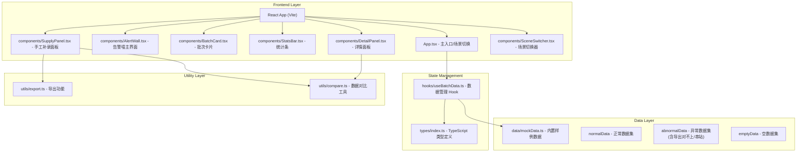
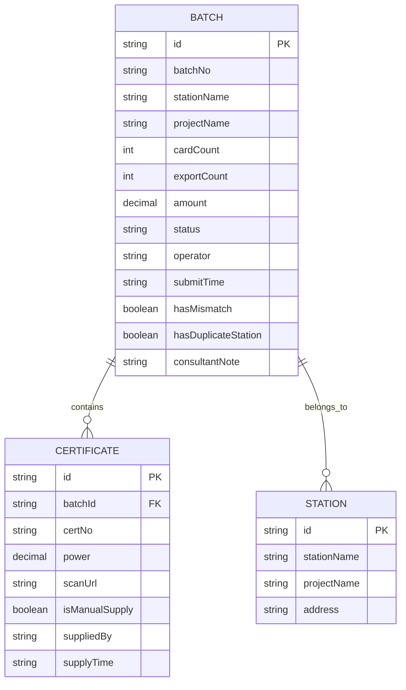

## 1. 架构设计



## 2. 技术选型

- **前端框架**: React 18 + TypeScript 5
- **构建工具**: Vite 5
- **样式方案**: TailwindCSS 3.4
- **图标**: Lucide React
- **动画**: Framer Motion
- **数据**: 纯前端 Mock 数据（内置三种场景）

## 3. 目录结构

```
src/
├── main.tsx              # 应用入口
├── App.tsx               # 根组件，场景切换逻辑
├── index.css             # 全局样式 + Tailwind 配置
├── types/
│   └── index.ts          # 类型定义
├── data/
│   └── mockData.ts       # 内置样例数据（正常/异常/空）
├── hooks/
│   └── useBatchData.ts   # 数据管理 Hook
├── utils/
│   ├── export.ts         # 导出功能
│   └── compare.ts        # 数据对比工具
├── components/
│   ├── Header.tsx        # 顶部导航
│   ├── StatsBar.tsx      # 统计卡片条
│   ├── AlertWall.tsx     # 告警墙卡片网格
│   ├── BatchCard.tsx     # 批次卡片组件
│   ├── DetailPanel.tsx   # 右侧详情面板
│   ├── SupplyPanel.tsx   # 手工补录面板
│   └── SceneSwitcher.tsx # 场景切换器
└── assets/
    └── certificate.svg   # 证书扫描件占位图
```

## 4. 路由定义

| 路由 | 用途 |
|------|------|
| / | 告警墙首页（单页应用，无额外路由） |

## 5. 数据模型

### 5.1 数据模型定义



### 5.2 TypeScript 类型定义

```typescript
export type DataScene = 'normal' | 'abnormal' | 'empty';

export interface BatchData {
  id: string;
  batchNo: string;
  stationName: string;
  projectName: string;
  cardCount: number;
  exportCount: number;
  amount: number;
  status: 'pending' | 'processing' | 'completed' | 'error';
  operator: string;
  submitTime: string;
  hasMismatch: boolean;
  hasDuplicateStation: boolean;
  mismatchDetail?: {
    diffItems: { name: string; cardValue: number; exportValue: number }[];
    reason: string;
  };
  duplicateStations?: {
    id: string;
    projectName: string;
    address: string;
    certCount: number;
  }[];
  certificates: Certificate[];
  consultantNote?: string;
}

export interface Certificate {
  id: string;
  certNo: string;
  power: number;
  scanUrl?: string;
  isManualSupply: boolean;
  suppliedBy?: string;
  supplyTime?: string;
}

export interface StatsData {
  total: number;
  abnormal: number;
  pending: number;
  completed: number;
}
```

### 5.3 内置数据场景说明

| 场景 | 数据特点 | 关键测试点 |
|------|---------|-----------|
| normal | 8 个批次，数据全部一致 | 验证正常结算流程 |
| abnormal | 8 个批次，含 2 个异常 | 批次 3: 导出 128 vs 卡片 132<br/>批次 5: "创智园 A 座" 同名串站 |
| empty | 0 个批次 | 空状态展示、友好提示 |

**异常场景具体设计：**
1. **导出数字和卡片对不上**（批次 LC-2026-003）
   - 卡片显示：132 张，金额 52,800 元
   - 导出数字：128 张，金额 51,200 元
   - 差异项：证书编号 GC-2026-0543 至 GC-2026-0546 共 4 张缺失
   - 原因：系统接口超时导致部分数据未同步

2. **站点同名串站**（批次 LC-2026-005）
   - 站点名："创智园 A 座"
   - 实际归属：两个不同项目（创智园一期 / 创智园三期）
   - 串站明细：
     - 站点 ID: ST-0012，归属创智园一期，证书 67 张
     - 站点 ID: ST-0089，归属创智园三期，证书 58 张
   - 操作员：王结算，操作时间 2026-06-08 14:23

3. **周顾问手工补录**
   - 补录入口：任意批次详情页
   - 补录人：周顾问
   - 补录内容：证书扫描件 + 证书编号 + 电量
   - 对比功能：补录前后数据对比 + 导出读回验证
