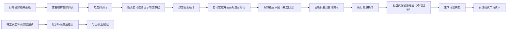

## 1. 产品概述

能源碳排台账追踪面板是面向楼宇节能顾问、值班员、资产负责人的企业级碳排数据管理工具。解决碳排台账数据核对、批量操作追溯、排放因子说明管理等核心痛点，实现数据可视化联动、操作可追溯、导出可复用的完整闭环。

- 核心目标：提升碳排台账管理效率，避免人工粘贴排放因子说明，确保批量操作可复盘，导出摘要清晰可追溯
- 目标用户：楼宇节能顾问（主要操作者）、值班员（日常审核）、资产负责人（决策查阅）
- 核心价值：列表-图表双向联动、操作留痕不可回滚、排放因子说明结构化管理

## 2. 核心功能

### 2.1 用户角色

| 角色 | 注册方式 | 核心权限 |
|------|----------|----------|
| 楼宇节能顾问 | 企业账号登录 | 台账编辑、批量操作、排放因子补录、导出 |
| 值班员 | 企业账号登录 | 台账查看、撤回原因编辑、白话提示查看 |
| 资产负责人 | 企业账号登录 | 摘要查看、导出接收、待拍板记录确认 |

### 2.2 功能模块

1. **台账追踪面板主页**：碳排台账列表、勾选联动图表、图表点选回链明细
2. **批量操作复盘页**：批量操作历史、原始值保留、操作人追溯
3. **导出摘要模块**：数量统计、原因说明、处理人记录、待拍板标记
4. **排放因子说明管理**：韩工补录说明展示、补录前后差异对比、导出读回

### 2.3 页面详情

| 页面名称 | 模块名称 | 功能描述 |
|----------|----------|----------|
| 台账追踪面板 | 台账列表 | 支持多选勾选、撤回原因编辑覆盖旧值、白话提示浮窗 |
| 台账追踪面板 | 碳排趋势图表 | ECharts柱状图/折线图、点选柱图跳转到对应台账行 |
| 台账追踪面板 | 排放因子说明卡片 | 韩工手工补录记录、差异对比按钮、导出/导入按钮 |
| 批量操作复盘页 | 操作历史列表 | 显示批量操作记录、原始值与新值对比、无回滚标识 |
| 导出摘要弹窗 | 摘要预览 | 统计数量、原因汇总、处理人、待拍板记录高亮 |

## 3. 核心流程

## 4. 用户界面设计

### 4.1 设计风格

- 主色调：专业稳重的深青色 `#0F4C5C`，象征环保与专业性
- 辅助色：数据绿 `#2ECC71`、警示橙 `#F39C12`、待处理蓝 `#3498DB`
- 按钮风格：圆角4px、悬停微阴影、点击反馈
- 字体：标题使用 `Noto Sans SC` 700，正文使用 `Inter` 400/500，确保中英文混排美观
- 布局风格：左侧列表 + 右侧图表的双栏布局，顶部操作栏，底部排放因子卡片
- 图标：使用 lucide-react 线性图标，保持简洁专业

### 4.2 页面设计概览

| 页面名称 | 模块名称 | UI元素 |
|----------|----------|--------|
| 台账追踪面板 | 顶部操作栏 | 批量操作按钮、导出按钮、复盘页入口、日期筛选 |
| 台账追踪面板 | 台账列表 | 复选框、数据列、撤回原因编辑列、操作列、高亮动画 |
| 台账追踪面板 | 图表区域 | ECharts双图（柱状+趋势）、标题、图例、下载按钮 |
| 台账追踪面板 | 排放因子卡片 | 补录人头像、时间戳、说明文本、差异对比高亮 |
| 批量操作复盘页 | 历史列表 | 操作时间、操作人、操作类型、原始值/新值对比标签 |
| 导出摘要弹窗 | 摘要内容 | 分类统计卡片、原因列表、处理人签名、待拍板醒目标记 |

### 4.3 响应式

- 桌面端（1440px+）：左右双栏布局，列表60%宽度，图表40%宽度
- 平板端（768px-1440px）：上下布局，列表在上图表在下
- 移动端（<768px）：单列布局，图表可横向滚动，操作按钮固定底部

### 4.4 交互动效

- 列表勾选：背景色渐变为浅青色，图表数据同步刷新动画（300ms ease-out）
- 图表点选：对应列表行高亮闪烁（2次黄色高亮脉冲），自动滚动到可视区域
- 撤回原因编辑：旧值淡出+新值淡入，白话提示气泡从右侧滑入
- 批量操作：确认弹窗展示影响数量，执行后顶部消息条提示"操作已生效，不可回滚"
- 导出：进度条动画，完成后提供下载链接和复制邮箱功能
