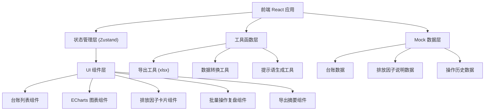
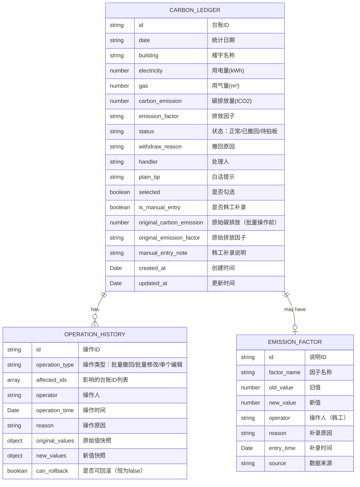

## 1. 架构设计



## 2. 技术描述

- **前端框架**：React@18 + TypeScript + Vite
- **状态管理**：Zustand（轻量级，适合企业级中后台）
- **UI 组件库**：Ant Design@5（企业级组件，内置表格、弹窗、表单）
- **图表库**：ECharts@5（支持复杂交互和事件绑定）
- **样式方案**：TailwindCSS@3 + CSS Variables
- **导出功能**：xlsx (SheetJS) + file-saver
- **图标**：lucide-react
- **初始化工具**：vite-init react-ts 模板
- **后端**：无（纯前端Mock数据，模拟真实业务场景）
- **数据库**：localStorage 持久化操作历史

## 3. 路由定义

| 路由 | 用途 |
|------|------|
| / | 台账追踪面板主页（列表+图表+排放因子卡片） |
| /review | 批量操作复盘页 |

## 4. 数据模型

### 4.1 数据模型定义



### 4.2 TypeScript 类型定义

```typescript
interface CarbonLedger {
  id: string;
  date: string;
  building: string;
  electricity: number;
  gas: number;
  carbonEmission: number;
  emissionFactor: string;
  status: 'normal' | 'withdrawn' | 'pending';
  withdrawReason: string;
  handler: string;
  plainTip: string;
  selected: boolean;
  isManualEntry: boolean;
  originalCarbonEmission: number;
  originalEmissionFactor: string;
  manualEntryNote: string;
  createdAt: string;
  updatedAt: string;
}

interface EmissionFactorNote {
  id: string;
  factorName: string;
  oldValue: number;
  newValue: number;
  operator: string;
  reason: string;
  entryTime: string;
  source: string;
}

interface OperationHistory {
  id: string;
  operationType: 'batch_withdraw' | 'batch_modify' | 'single_edit';
  affectedIds: string[];
  operator: string;
  operationTime: string;
  reason: string;
  originalValues: Record<string, Partial<CarbonLedger>>;
  newValues: Record<string, Partial<CarbonLedger>>;
  canRollback: false;
}

interface ExportSummary {
  totalCount: number;
  withdrawnCount: number;
  pendingCount: number;
  normalCount: number;
  reasons: { reason: string; count: number }[];
  handlers: { name: string; count: number }[];
  pendingRecords: CarbonLedger[];
  exportTime: string;
  exportBy: string;
}
```

## 5. 核心功能实现要点

### 5.1 列表-图表双向联动

- 勾选列表行 → 更新 Zustand store 中 `selected` 字段 → 图表组件订阅选中数据 → ECharts `setOption` 刷新
- 图表 `click` 事件 → 获取 dataIndex → 找到对应台账ID → 调用列表组件 `scrollToRow` 方法 → 触发高亮动画

### 5.2 撤回原因覆盖与白话提示

- 编辑撤回原因 → 直接覆盖 `withdrawReason` 字段 → 不保留历史版本
- 根据 `withdrawReason` 关键词自动生成 `plainTip`（使用映射表）
- 值班员视角：hover 显示 Tooltip 展示白话翻译

### 5.3 批量操作与复盘页

- 批量操作前：快照原始值到 `originalValues`
- 执行操作：更新数据 + 创建 `OperationHistory` 记录 + `canRollback = false`
- 复盘页：展示历史记录，对比原始值与新值，明确标识"不可回滚"

### 5.4 导出摘要

- 按状态统计数量 → 聚合原因和处理人 → 提取待拍板记录 → 生成 `ExportSummary`
- 导出 Excel：多 Sheet 设计（汇总、原因明细、待拍板记录）
- 支持复制邮箱功能，一键发送给资产负责人

### 5.5 韩工补录排放因子说明

- 特殊标记记录：`isManualEntry = true`，显示"韩工补录"标签
- 差异对比：高亮显示 `originalCarbonEmission` 与 `carbonEmission` 的差值
- 导出/读回：导出时包含补录说明，导入时验证数据一致性
