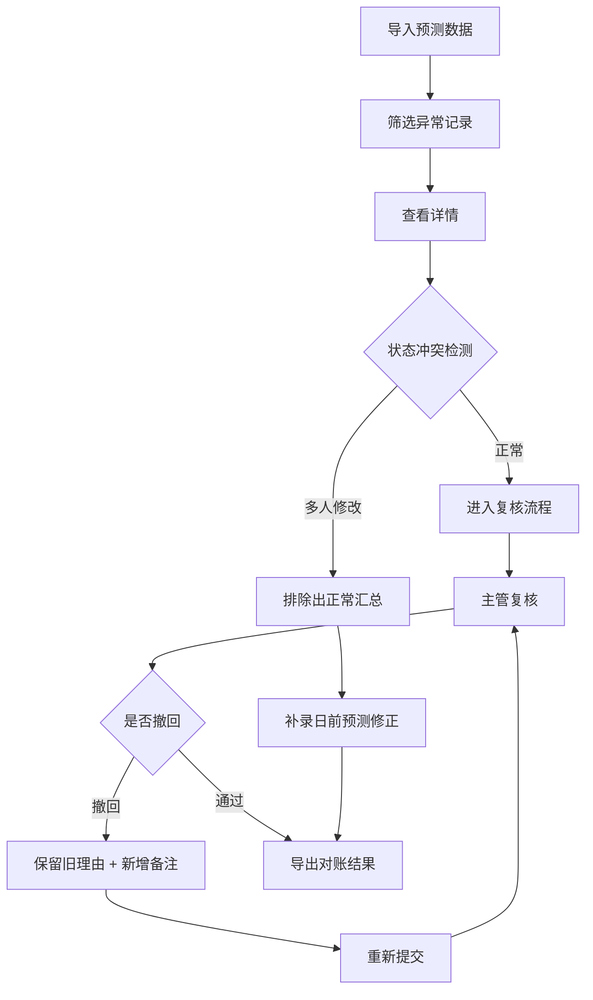

## 1. 产品概述

能源负荷预测对账系统，用于电力行业负荷预测数据的审核、修正与对账管理。解决客服回访异常数据混入正常汇总、多人修改状态冲突、空白字段详情崩溃、撤回重提备注丢失等业务痛点。

- 核心用户：对账操作员（钟姐）、审核主管
- 核心价值：确保负荷预测数据准确性，建立可追溯的对账流程，支持手工补录修正并对比差异

---

## 2. 核心功能

### 2.1 用户角色

| 角色 | 注册方式 | 核心权限 |
|------|----------|----------|
| 对账操作员 | 工号登录 | 数据导入、筛选查看、补录修正、导出数据 |
| 审核主管 | 工号登录 | 复核结论、撤回重提、审批确认 |

### 2.2 功能模块

1. **能源负荷预测对账页**：数据列表、筛选条件、操作按钮区、预测曲线图表
2. **详情弹窗**：单条记录详情、原始材料链接、状态变更历史
3. **补录修正弹窗**：日前预测修正手工录入、差异对比
4. **撤回重提弹窗**：旧理由保留、新备注追加、状态流转

### 2.3 页面详情

| 页面名称 | 模块名称 | 功能描述 |
|----------|----------|----------|
| 对账主页 | 顶部操作栏 | 导入、导出按钮，预测版本切换，偏差排序 |
| 对账主页 | 筛选区 | 时间范围、设备编号、状态、异常标记筛选 |
| 对账主页 | 数据列表 | 设备编号、预测值、修正值、实际值、偏差率、状态、操作列 |
| 对账主页 | 曲线图区 | 日前预测修正曲线、实际曲线、偏差高亮 |
| 对账主页 | 补录区 | 钟姐手工补录日前预测修正记录行 |
| 详情弹窗 | 基本信息 | 完整字段展示，空白字段兜底显示 |
| 详情弹窗 | 状态历史 | 多人修改记录，避免状态冲突计入正常汇总 |
| 详情弹窗 | 原始材料 | 跳转返回原始客服回访表数据源 |
| 撤回重提弹窗 | 备注区 | 旧理由只读展示，新备注独立输入 |

---

## 3. 核心流程

**主对账流程**：
导入负荷预测数据 → 筛选异常记录 → 查看详情 → 确认状态冲突 → 补录日前修正 → 主管复核 → 导出对账结果

**撤回重提流程**：
主管撤回已提交结论 → 系统保留原始审核理由 → 操作员补充新备注 → 重新提交 → 系统合并展示新旧理由

---

## 4. 用户界面设计

### 4.1 设计风格

- **主色调**：工业蓝 #165DFF（代表电力行业专业感）
- **辅助色**：警示橙 #FF7D00（异常标记）、成功绿 #00B42A（复核通过）、错误红 #F53F3F（严重偏差）
- **按钮风格**：扁平直角按钮，2px圆角，hover时有轻微背景加深
- **字体**：标题使用 "Noto Sans SC" 700，正文使用 "JetBrains Mono" 400（数据表格用等宽字体保证对齐）
- **布局风格**：顶部导航 + 左侧筛选 + 主内容区（列表+图表上下布局）
- **图标风格**：线性图标，统一16px尺寸

### 4.2 页面设计概述

| 页面名称 | 模块名称 | UI元素 |
|----------|----------|--------|
| 对账主页 | 操作栏 | 深色背景，按钮紧凑排列，版本切换下拉框右对齐 |
| 对账主页 | 筛选区 | 卡片式容器，多条件行内排列，筛选结果计数 |
| 对账主页 | 数据列表 | 斑马纹行，异常行橙色背景，偏差列红绿色阶 |
| 对账主页 | 曲线图 | 双Y轴，预测曲线蓝色、实际曲线灰色、修正曲线橙色虚线 |
| 对账主页 | 补录行 | 固定在列表底部，浅蓝底色，可编辑单元格 |
| 详情弹窗 | 备注区 | 旧理由灰色斜体，新备注黑色正文，时间戳分割线 |

### 4.3 响应性

- **桌面优先**：最小支持1280px宽度
- **列表横向滚动**：数据列过多时支持水平滚动，操作列固定右侧
- **图表自适应**：曲线图随容器宽度自动调整，断点≤768px时转为单列布局

### 4.4 数据可视化重点

- 日前预测修正曲线用橙色虚线突出显示
- 偏差超过±5%的数据点用红色圆点标记
- 鼠标悬停显示精确数值和偏差百分比
- 版本切换时曲线平滑过渡动画
