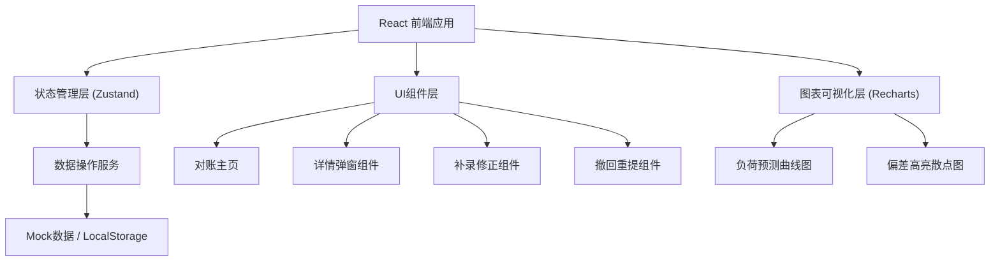
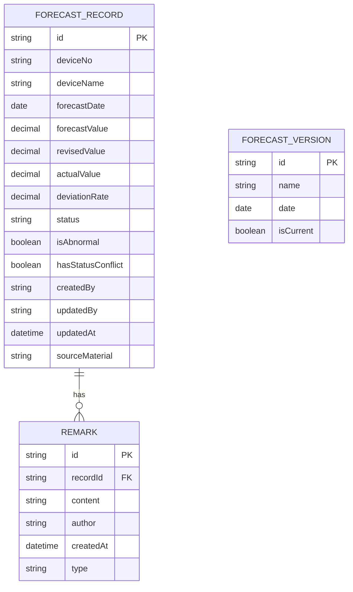

## 1. 架构设计



## 2. 技术描述

- **前端**：React@18.2.0 + TypeScript@5 + TailwindCSS@3.4 + Vite@5
- **状态管理**：Zustand@4（轻量级，适合表单和列表状态）
- **图表库**：Recharts@2.12（React生态，支持自定义曲线样式）
- **图标**：Lucide React@0.344（线性图标库）
- **数据持久化**：LocalStorage（模拟后端，支持导出导入）
- **初始化工具**：pnpm create vite

## 3. 路由定义

| 路由 | 用途 |
|------|------|
| / | 能源负荷预测对账主页（单页应用，无路由跳转） |

## 4. 类型定义

```typescript
// 负荷预测记录
interface ForecastRecord {
  id: string;
  deviceNo: string;
  deviceName: string;
  forecastDate: string;
  forecastValue: number;      // 原始预测值
  revisedValue?: number;      // 日前修正值（补录）
  actualValue: number;        // 实际值
  deviationRate: number;      // 偏差率
  status: 'pending' | 'reviewed' | 'withdrawn' | 'approved';
  isAbnormal: boolean;        // 是否异常（客服回访标记）
  hasStatusConflict: boolean; // 状态冲突（多人修改）
  createdBy: string;
  updatedBy?: string;
  updatedAt: string;
  remarks: Remark[];          // 备注历史
  sourceMaterial?: string;    // 原始材料链接
}

// 备注记录
interface Remark {
  id: string;
  content: string;
  author: string;
  createdAt: string;
  type: 'original' | 'new';   // 旧理由 / 新备注
}

// 预测版本
interface ForecastVersion {
  id: string;
  name: string;
  date: string;
  isCurrent: boolean;
}

// 筛选条件
interface FilterParams {
  dateRange: [string, string];
  deviceNo: string;
  status: string;
  isAbnormal: boolean | null;
  hasStatusConflict: boolean | null;
  deviationSort: 'asc' | 'desc' | null;
}

// 图表数据点
interface ChartDataPoint {
  hour: number;
  forecast: number;
  revised: number;
  actual: number;
  deviation: number;
}
```

## 5. 数据模型



## 6. 核心业务规则实现

### 6.1 状态冲突检测
- 同一记录 `updatedBy` 字段存在多个不同值时，标记 `hasStatusConflict = true`
- 汇总统计时自动过滤 `hasStatusConflict = true` 的记录

### 6.2 空白字段兜底
- 详情页渲染时对 `null/undefined` 字段显示 `--`
- 原始材料链接为空时禁用按钮并提示"暂无原始材料"

### 6.3 备注保留机制
- 撤回操作将原有备注 `type` 标记为 `'original'` 并设为只读
- 新提交备注 `type` 标记为 `'new'`，与旧备注分区展示

### 6.4 补录修正
- 补录行单独存储，`revisedValue` 字段有值时曲线自动切换为修正曲线
- 导出时同时包含原始预测值和修正值两列

## 7. 目录结构

```
src/
├── types/              # 类型定义
│   └── index.ts
├── store/              # 状态管理
│   └── useForecastStore.ts
├── data/               # Mock数据
│   └── mockData.ts
├── components/         # 组件
│   ├── ActionBar.tsx       # 顶部操作栏
│   ├── FilterPanel.tsx     # 筛选面板
│   ├── DataTable.tsx       # 数据列表
│   ├── ForecastChart.tsx   # 预测曲线图
│   ├── ManualEntryRow.tsx  # 手工补录行
│   ├── DetailModal.tsx     # 详情弹窗
│   ├── WithdrawModal.tsx   # 撤回重提弹窗
│   └── ReviseModal.tsx     # 补录修正弹窗
├── utils/              # 工具函数
│   ├── export.ts           # 导出工具
│   └── calculation.ts      # 偏差计算
├── App.tsx
├── main.tsx
└── index.css
```
