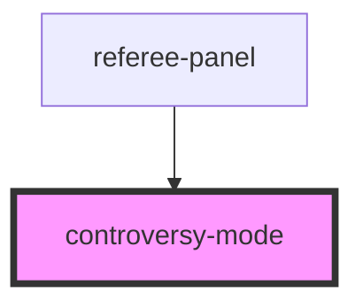

# controversy-mode

<!-- Auto Generated Below -->

## Properties

| Property      | Attribute      | Description | Type            | Default |
| ------------- | -------------- | ----------- | --------------- | ------- |
| `active`      | `active`       |             | `boolean`       | `false` |
| `maxLookback` | `max-lookback` |             | `number`        | `3`     |
| `touches`     | --             |             | `TouchRecord[]` | `[]`    |

## Events

| Event             | Description | Type                                              |
| ----------------- | ----------- | ------------------------------------------------- |
| `annotationAdded` |             | `CustomEvent<{ touchId: string; text: string; }>` |
| `exitRequested`   |             | `CustomEvent<void>`                               |

## Methods

### `resetSelection() => Promise<void>`

#### Returns

Type: `Promise<void>`

## Dependencies

### Used by

 - [referee-panel](../referee-panel)

### Graph

----------------------------------------------

*Built with [StencilJS](https://stenciljs.com/)*
