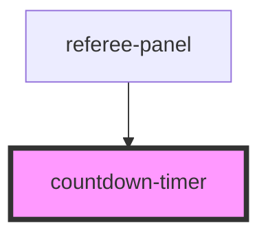

# countdown-timer

<!-- Auto Generated Below -->

## Properties

| Property         | Attribute         | Description | Type      | Default  |
| ---------------- | ----------------- | ----------- | --------- | -------- |
| `autoStart`      | `auto-start`      |             | `boolean` | `false`  |
| `fullscreen`     | `fullscreen`      |             | `boolean` | `false`  |
| `initialSeconds` | `initial-seconds` |             | `number`  | `45`     |
| `label`          | `label`           |             | `string`  | `'局间休息'` |

## Events

| Event        | Description | Type                  |
| ------------ | ----------- | --------------------- |
| `timerEnded` |             | `CustomEvent<void>`   |
| `timerTick`  |             | `CustomEvent<number>` |

## Methods

### `pause() => Promise<void>`

#### Returns

Type: `Promise<void>`

### `reset() => Promise<void>`

#### Returns

Type: `Promise<void>`

### `start() => Promise<void>`

#### Returns

Type: `Promise<void>`

## Dependencies

### Used by

 - [referee-panel](../referee-panel)

### Graph

----------------------------------------------

*Built with [StencilJS](https://stenciljs.com/)*
