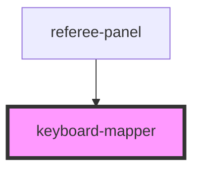

# keyboard-mapper

<!-- Auto Generated Below -->

## Properties

| Property   | Attribute  | Description | Type              | Default                                                                                                                                                                                                                                                                                                                                                                                                                        |
| ---------- | ---------- | ----------- | ----------------- | ------------------------------------------------------------------------------------------------------------------------------------------------------------------------------------------------------------------------------------------------------------------------------------------------------------------------------------------------------------------------------------------------------------------------------ |
| `disabled` | `disabled` |             | `boolean`         | `false`                                                                                                                                                                                                                                                                                                                                                                                                                        |
| `mapping`  | --         |             | `KeyboardMapping` | `{   F1: 'LEFT_VALID',   F2: 'RIGHT_VALID',   F3: 'LEFT_OFFTARGET',   F4: 'RIGHT_OFFTARGET',   F5: 'SIMULTANEOUS',   F6: 'NO_TOUCH',   F7: 'LEFT_YELLOW',   F8: 'RIGHT_YELLOW',   F9: 'LEFT_RED',   F10: 'RIGHT_RED',   F11: 'LEFT_BLACK',   F12: 'RIGHT_BLACK',   Backspace: 'UNDO_LAST',   Space: 'PAUSE_PERIOD',   KeyB: 'START_BREAK',   KeyC: 'CONTROVERSY_TOGGLE',   KeyE: 'REQUEST_SCORE_EDIT',   KeyS: 'SEAL_BOUT', }` |

## Events

| Event         | Description | Type                                                                                                                                                                                                                                                                                                                                    |
| ------------- | ----------- | --------------------------------------------------------------------------------------------------------------------------------------------------------------------------------------------------------------------------------------------------------------------------------------------------------------------------------------- |
| `actionFired` |             | `CustomEvent<"CONTROVERSY_TOGGLE" \| "LEFT_BLACK" \| "LEFT_OFFTARGET" \| "LEFT_RED" \| "LEFT_VALID" \| "LEFT_YELLOW" \| "NO_TOUCH" \| "PAUSE_PERIOD" \| "REQUEST_SCORE_EDIT" \| "RIGHT_BLACK" \| "RIGHT_OFFTARGET" \| "RIGHT_RED" \| "RIGHT_VALID" \| "RIGHT_YELLOW" \| "SEAL_BOUT" \| "SIMULTANEOUS" \| "START_BREAK" \| "UNDO_LAST">` |

## Dependencies

### Used by

 - [referee-panel](../referee-panel)

### Graph

----------------------------------------------

*Built with [StencilJS](https://stenciljs.com/)*
