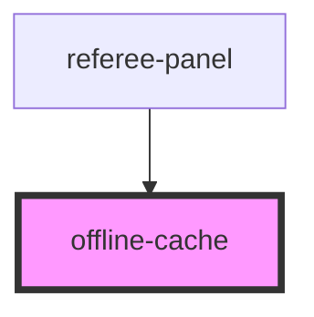

# offline-cache

<!-- Auto Generated Below -->

## Properties

| Property         | Attribute         | Description | Type     | Default |
| ---------------- | ----------------- | ----------- | -------- | ------- |
| `uploadEndpoint` | `upload-endpoint` |             | `string` | `''`    |

## Events

| Event          | Description | Type                                                |
| -------------- | ----------- | --------------------------------------------------- |
| `cachedLoaded` |             | `CustomEvent<any>`                                  |
| `syncComplete` |             | `CustomEvent<{ success: number; failed: number; }>` |

## Methods

### `clearAll() => Promise<void>`

#### Returns

Type: `Promise<void>`

### `listBouts() => Promise<Array<{ id: string; savedAt: number; }>>`

#### Returns

Type: `Promise<{ id: string; savedAt: number; }[]>`

### `loadBout(boutId: string) => Promise<any | null>`

#### Parameters

| Name     | Type     | Description |
| -------- | -------- | ----------- |
| `boutId` | `string` |             |

#### Returns

Type: `Promise<any>`

### `queueUpload(payload: any) => Promise<void>`

#### Parameters

| Name      | Type  | Description |
| --------- | ----- | ----------- |
| `payload` | `any` |             |

#### Returns

Type: `Promise<void>`

### `removeBout(boutId: string) => Promise<boolean>`

#### Parameters

| Name     | Type     | Description |
| -------- | -------- | ----------- |
| `boutId` | `string` |             |

#### Returns

Type: `Promise<boolean>`

### `saveBout(boutId: string, state: any) => Promise<boolean>`

#### Parameters

| Name     | Type     | Description |
| -------- | -------- | ----------- |
| `boutId` | `string` |             |
| `state`  | `any`    |             |

#### Returns

Type: `Promise<boolean>`

### `syncQueue() => Promise<{ success: number; failed: number; }>`

#### Returns

Type: `Promise<{ success: number; failed: number; }>`

## Dependencies

### Used by

 - [referee-panel](../referee-panel)

### Graph

----------------------------------------------

*Built with [StencilJS](https://stenciljs.com/)*
