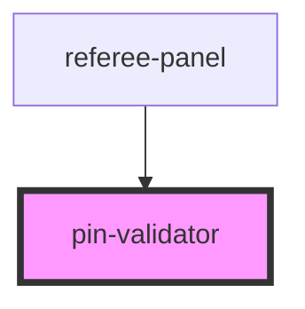

# pin-validator

<!-- Auto Generated Below -->

## Properties

| Property           | Attribute           | Description | Type               | Default                                                                                               |
| ------------------ | ------------------- | ----------- | ------------------ | ----------------------------------------------------------------------------------------------------- |
| `accounts`         | --                  |             | `RefereeAccount[]` | `[   { pin: '1111', name: '主裁判' },   { pin: '2222', name: '副裁判' },   { pin: '3333', name: '裁判长' }, ]` |
| `open`             | `open`              |             | `boolean`          | `false`                                                                                               |
| `panelTitle`       | `panel-title`       |             | `string`           | `'改分需双裁判 PIN 验证'`                                                                                     |
| `requiredReferees` | `required-referees` |             | `number`           | `2`                                                                                                   |

## Events

| Event       | Description | Type                               |
| ----------- | ----------- | ---------------------------------- |
| `cancelled` |             | `CustomEvent<void>`                |
| `validated` |             | `CustomEvent<PinValidationResult>` |

## Methods

### `reset() => Promise<void>`

#### Returns

Type: `Promise<void>`

## Dependencies

### Used by

 - [referee-panel](../referee-panel)

### Graph

----------------------------------------------

*Built with [StencilJS](https://stenciljs.com/)*
