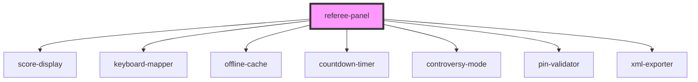

# referee-panel

<!-- Auto Generated Below -->

## Dependencies

### Depends on

- [score-display](../score-display)
- [keyboard-mapper](../keyboard-mapper)
- [offline-cache](../offline-cache)
- [countdown-timer](../countdown-timer)
- [controversy-mode](../controversy-mode)
- [pin-validator](../pin-validator)
- [xml-exporter](../xml-exporter)

### Graph

----------------------------------------------

*Built with [StencilJS](https://stenciljs.com/)*
