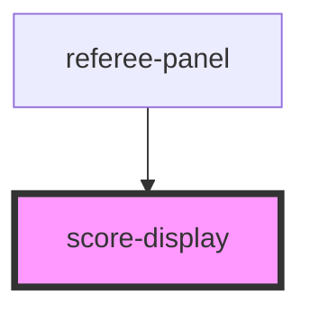

# score-display

<!-- Auto Generated Below -->

## Properties

| Property        | Attribute        | Description | Type      | Default |
| --------------- | ---------------- | ----------- | --------- | ------- |
| `leftName`      | `left-name`      |             | `string`  | `'左方'`  |
| `leftPriority`  | `left-priority`  |             | `boolean` | `false` |
| `leftScore`     | `left-score`     |             | `number`  | `0`     |
| `period`        | `period`         |             | `number`  | `1`     |
| `rightName`     | `right-name`     |             | `string`  | `'右方'`  |
| `rightPriority` | `right-priority` |             | `boolean` | `false` |
| `rightScore`    | `right-score`    |             | `number`  | `0`     |
| `targetScore`   | `target-score`   |             | `number`  | `15`    |
| `timeRemaining` | `time-remaining` |             | `number`  | `180`   |

## Methods

### `applyCard(side: "left" | "right", type: "yellow" | "red" | "black") => Promise<void>`

#### Parameters

| Name   | Type                           | Description |
| ------ | ------------------------------ | ----------- |
| `side` | `"left" \| "right"`            |             |
| `type` | `"red" \| "yellow" \| "black"` |             |

#### Returns

Type: `Promise<void>`

### `triggerFlash(side: "left" | "right" | "both") => Promise<void>`

#### Parameters

| Name   | Type                          | Description |
| ------ | ----------------------------- | ----------- |
| `side` | `"left" \| "right" \| "both"` |             |

#### Returns

Type: `Promise<void>`

## Dependencies

### Used by

 - [referee-panel](../referee-panel)

### Graph

----------------------------------------------

*Built with [StencilJS](https://stenciljs.com/)*
