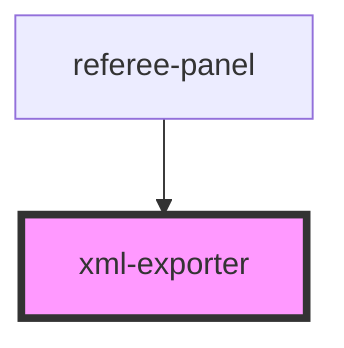

# xml-exporter

<!-- Auto Generated Below -->

## Properties

| Property              | Attribute              | Description | Type      | Default |
| --------------------- | ---------------------- | ----------- | --------- | ------- |
| `associationEndpoint` | `association-endpoint` |             | `string`  | `''`    |
| `autoUpload`          | `auto-upload`          |             | `boolean` | `false` |
| `boutState`           | `bout-state`           |             | `any`     | `null`  |

## Events

| Event            | Description | Type                                               |
| ---------------- | ----------- | -------------------------------------------------- |
| `exportComplete` |             | `CustomEvent<{ xml: string; uploaded: boolean; }>` |
| `uploadFailed`   |             | `CustomEvent<{ error: string; }>`                  |

## Methods

### `buildXml() => Promise<string>`

#### Returns

Type: `Promise<string>`

### `download() => Promise<string>`

#### Returns

Type: `Promise<string>`

### `exportAndUpload() => Promise<{ xml: string; uploaded: boolean; }>`

#### Returns

Type: `Promise<{ xml: string; uploaded: boolean; }>`

### `uploadToAssociation() => Promise<boolean>`

#### Returns

Type: `Promise<boolean>`

## Dependencies

### Used by

 - [referee-panel](../referee-panel)

### Graph

----------------------------------------------

*Built with [StencilJS](https://stenciljs.com/)*
