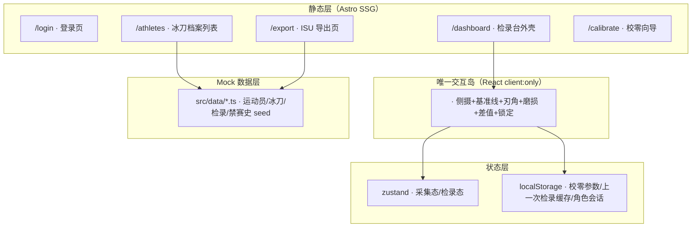

## 1. 架构设计

Astro 单岛架构：全站 90% 页面服务端静态渲染（SSR→静态预构建+路由懒加载），仅「刃角采集岛」一处使用 React island 做客户端 hydration，降负载、符合赛事实时操作需求。



## 2. 技术选型

- **框架**：Astro@4 + React@18（island: `client:visible`）
- **样式**：TailwindCSS@3 + CSS 变量（冰寒主题 tokens）
- **状态**：zustand（采集岛内局部）
- **PDF 导出**：jsPDF + 自定义 ISU 模板
- **QR 识别**：jsQR（canvas drawImage → 扫描）
- **Mock 数据**：TypeScript const 数据 + localStorage 持久化差异
- **字体**：@fontsource/orbitron、@fontsource/jetbrains-mono
- **图标**：lucide-react
- **包管理**：pnpm

## 3. 路由定义

| Route | 用途 | 渲染策略 |
|-------|------|----------|
| `/` | 重定向到 `/login` 或 `/dashboard`（依会话） | 静态 |
| `/login` | 登录 + 角色互斥校验 | 静态 + 轻量表单校验（JS 脚本） |
| `/dashboard` | 检录台主页 · 嵌入唯一 React Island | 静态外壳 + `<BladeCaptureIsland client:visible />` |
| `/athletes` | 冰刀档案列表 · 历次检录对比 · QR 跳转 | 静态 + 原生模态弹窗（无 hydration） |
| `/athletes/[id]` | 冰刀详情 · 禁赛史 · 差值对比表 | 静态预渲染所有 id |
| `/export` | ISU 名单批量勾选 + PDF 下载 | 静态 + 导出按钮 JS 脚本 |
| `/calibrate` | 镜头畸变三步校零向导 | 静态 shell + 向导内 JS（非 island，用原生 script） |

## 4. 数据模型（TS 类型 + Mock）

### 4.1 类型定义

```ts
export type Role = 'checker' | 'coach';

export interface User {
  id: string;
  username: string;
  password: string;
  role: Role;
  displayName: string;
}

export interface Athlete {
  id: string;           // 运动员编号
  name: string;
  country: string;
  isuId: string;        // ISU 注册号
  bladeQr: string;      // 冰刀 QR 码值，一对一绑定
  suspension: Suspension[];
}

export interface Suspension {
  startDate: string;
  endDate: string | null;
  reason: string;
  status: 'active' | 'ended';
}

export type WearLevel = 'normal' | 'mild' | 'moderate' | 'severe';

export interface BladeCheck {
  id: string;
  athleteId: string;
  bladeQr: string;
  eventId: string;
  sessionId: string;
  angleLeft: number;    // 左刃角 精度 0.1°
  angleRight: number;   // 右刃角
  wear: WearLevel;
  checkerId: string;
  checkedAt: string;
  postponeTag: boolean; // 暂缓参赛标签
  difference?: { left: number; right: number };
}

export interface EventSession {
  id: string;
  eventName: string;
  startTime: string;    // ISO 时间
  lockMinutes: number;  // 默认 30
  status: 'open' | 'locked' | 'finished';
}

export interface CalibrationParams {
  calibratedAt: string;
  corners: { tl: [number, number]; tr: [number, number]; bl: [number, number]; br: [number, number] };
  scale: number;
}
```

### 4.2 Mock Seed

- 12 名运动员含中/荷/韩/俄/加五国旗
- 2 场赛事（一个已开、一个即将开始）
- 每人 1-3 条历史检录
- 2 用户（checker=检录员01 / coach=王教练）用于演示互斥
- 1 人带激活禁赛史用于 QR 跳转演示

## 5. 关键实现要点

1. **单岛架构**：`/dashboard` 中仅 `<BladeCaptureIsland client:visible />` 一个 React 岛；其余页面使用 Astro 原生 `<script is:inline>` 处理交互（模态、QR 跳转、倒计时冻结）。
2. **侧摄画面**：`<video>` 调用 `navigator.mediaDevices.getUserMedia`（无权限时降级为循环 Mock 视频），canvas 叠层绘制 0°基准线与刃口 SVG 轮廓。
3. **角度计算**：前端模拟——拖动两个锚点计算与水平线夹角，0.1° 步进；|本次-上次|>5° 触发标红与锁提交。
4. **赛前 30 分钟锁定**：setInterval 轮询 `startTime - now`；达阈值后 UI 灰置 + localStorage 写入锁标记。
5. **角色互斥**：登录成功后写入 localStorage.role，访问另一角色页面时拦截并弹错。
6. **暂缓参赛标签**：超阈行必选 checkbox，未选时提交按钮 `disabled`。
7. **三步校零**：①直尺入镜提示 → ②点击四角取点 → ③计算透视参数并写入 `localStorage.calibration`。
8. **ISU PDF**：jsPDF 按标准表头输出赛事 + 运动员 + 刃角 + 状态签章。
