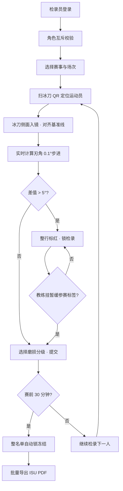

## 1. 产品概述

冰刀刃角采集台是速滑队冬训基地的检录辅助系统，取代纸质刃角记录，解决审计发现的同一冰刀两次测量 1.2° 无法溯源的问题。系统面向检录员与教练两种角色，以赛前 30 分钟自动锁名单、超阈冰刀必须标注暂缓参赛为合规刚性约束。

- 目标用户：速滑队检录员（操作采集）、教练（审核与档案查阅）
- 核心价值：消除纸质记录误差、实现冰刀-运动员 QR 双向溯源、自动合规拦截

## 2. 核心功能

### 2.1 用户角色

| 角色 | 注册方式 | 核心权限 |
|------|----------|----------|
| 检录员 | 管理员分配 | 执行刃角采集、提交检录、导出 ISU 名单 |
| 教练 | 管理员分配 | 查阅档案与禁赛史、审核暂缓参赛标签 |
| 合规约束 | —— | 同一账号不可同时兼任检录员与教练 |

### 2.2 功能模块

1. **登录与角色选择页**：账号登录 + 角色互斥校验
2. **检录台主页（含采集岛）**：侧摄画面、基准线对齐、实时刃角显示、磨损分级、差值列
3. **冰刀档案列表页**：扫 QR 跳转详情、历次检录对比、禁赛史弹窗
4. **ISU 检录导出页**：批量勾选 + PDF 导出
5. **镜头校零向导**：三步畸变校准流程

### 2.3 页面详情

| 页面名称 | 模块名称 | 功能描述 |
|----------|----------|----------|
| 登录页 | 登录表单 | 账号密码、角色切换时互斥校验、错误提示 |
| 检录台主页 | 赛事信息栏 | 比赛名称、开始时间倒计时、赛前 30min 锁状态提示 |
| 检录台主页 | 检录名单表格 | 冰刀 QR、运动员、本次刃角、上次刃角、差值列、磨损级、状态、标签、操作 |
| 检录台主页 | 刃角采集岛（唯一 hydration） | 侧摄画面框、0°基准线叠加、刃口轮廓、实时角度 0.1°步进、超 5°整行标红、超限锁定 |
| 检录台主页 | 暂缓参赛标签 | 超阈冰刀必须手动勾选才允许提交 |
| 冰刀档案列表 | QR 扫描跳转 | 扫码或点击冰刀 ID 打开档案弹窗，含历次检录差值与禁赛史 |
| 冰刀档案列表 | 磨损四级下拉 | 四级选项绑定缩略图（正常/轻度/中度/重度） |
| ISU 导出页 | 批量导出 | 勾选已检录条目 → 生成符合 ISU 格式 PDF 下载 |
| 校零向导 | 三步校准 | ①放直尺→②取四个角点→③确认畸变参数，持久化到 localStorage |

## 3. 核心流程

检录员登录 → 选择赛事 → 扫冰刀 QR 定位条目 → 冰刀侧面对齐侧摄框基准线 → 实时显示刃口角度与磨损分级 → 差值超 5°整行标红并锁检录 → 教练审核并勾选「暂缓参赛」标签 → 提交锁定 → 赛前 30 分钟整名单自动冻结 → 导出 ISU PDF。

## 4. 用户界面设计

### 4.1 设计风格

- **主色**：冰寒冷调——`#0EA5E9`（冰蓝，主色）+ `#164E63`（深海蓝，深色背景）+ `#E0F2FE`（霜白，文本）
- **警示色**：`#EF4444`（超限红）、`#F59E0B`（琥珀预警）、`#10B981`（冰绿-正常）
- **按钮风格**：方角 2px 微倒角，带 1px 冰白内描边，按压下沉 1px
- **字体**：标题 `Orbitron`（运动科技感），正文 `JetBrains Mono`（等宽显示读数）
- **布局**：顶部赛事实时状态条 + 左侧检录表 + 右侧采集岛两栏布局
- **图标风格**：Lucide 线条风 · 统一 16px · 冰蓝描边

### 4.2 页面设计概览

| 页面名称 | 模块名称 | UI 元素 |
|----------|----------|---------|
| 登录页 | 登录卡 | 毛玻璃浮卡、冰蓝渐变背景条、Orbitron 标题、角色单选互斥 |
| 检录台主页 | 状态条 | 倒计时胶囊、锁图标切换、赛事名、场次号 |
| 检录台主页 | 名单表格 | 固定表头、差值列、超限行整行红色底纹渐变、冻结后整表灰置 |
| 检录台主页 | 采集岛 | 侧摄取景框（四角冰蓝刻度）、0°基准线（虚线+锚点可拖）、刃口轮廓（SVG 叠层）、大字号读数 |
| 采集岛 | 磨损下拉 | 选项前嵌入四级缩略图小方图、选中态高亮 |
| 采集岛 | 差值对比 | 双数对比卡片（本次 vs 上次）、Δ值带箭头 |
| 校零向导 | 步骤指示器 | 三步圆点进度、每步含说明与示意简图 |

### 4.3 响应式

- 桌面优先（1440+），采集岛固定 640×480 取景
- 平板端：名单表与采集岛上下堆叠
- 移动端：仅保留名单查看与 QR 扫码，采集功能禁用

### 4.4 视觉细节

- 冰刀侧摄框叠加冰蓝色网格 + 四角「┌ ┐└ ┘」刻度角标
- 整行标红：使用 `from-red-900/40 to-transparent` 横向渐变
- 倒计时进入 30 分钟时，数字跳动变红 + pulse 动画
- 刃口轮廓 SVG 实时描边动画，采稳后由虚线变实线
- 冻结后按钮灰化 + 挂锁徽标
