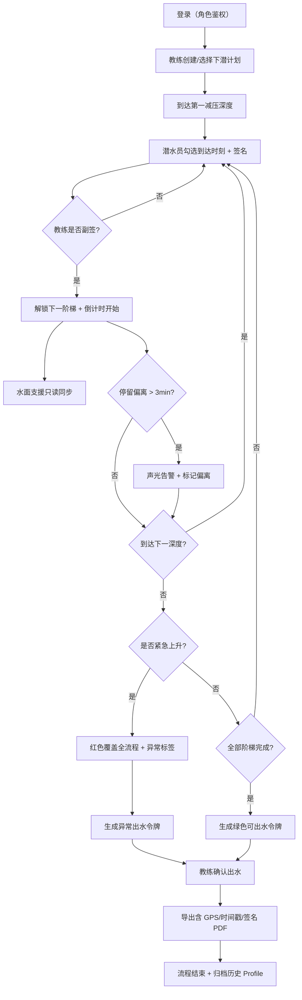

## 1. 产品概述

深潜减压核对台是一款面向商业潜水公司的现场作业合规系统，用于替代传统 Word 手写日志，满足海事局对减压停留记录的阶梯式电子确认要求。系统解决海水溅射环境下平板手写涂改无法取证的痛点，通过逐级解锁的深度—时间阶梯表强制记录每段减压停留的真实时刻与电子签名，确保每潜日志具备审计追溯效力。

- **目标用户**：潜水员（执行减压停留勾选）、教练（监督签字确认）、水面支援员（只读监控倒计时）、海事抽查员（事后 PDF 审计）
- **核心价值**：强制流程合规 → 杜绝减压病事故风险 → 满足法定抽查 → 免除公司责任

## 2. 核心功能

### 2.1 用户角色

| 角色 | 登录方式 | 核心权限 |
|------|---------|---------|
| 潜水员 (Diver) | 账号密码 / 工号 | 勾选本人所在阶梯的到达时刻、签署本人签名、触发紧急上升 |
| 教练 (Instructor) | 账号密码 / 工号 | 监督签字（不得代潜水员签）、解锁下潜计划、导出 PDF、授权紧急模式 |
| 水面支援 (Support) | 账号密码 / 工号 | 只读视图同步所有倒计时、接收偏离告警、不可操作任何勾选 |
| 管理员 (Admin) | 账号密码 | 管理账号、查看历史 dive profile |

### 2.2 功能模块

1. **登录鉴权页**：角色选择 + 工号登录，loader 集中鉴权，未登录重定向
2. **减压阶梯核对台（主路由）**：
   - 深度—时间阶梯表（自上而下从深水到水面逐级显示）
   - 每阶梯：计划深度/停留时长、实际到达时刻勾选框、GPS 自动打点、潜水员签名区、教练签名区
   - 逐级解锁机制（当前阶未签完 → 下一阶灰锁禁用）
   - 可出水令牌生成门（未全签 → 令牌禁用红色，全签 → 绿色准许出水）
3. **实时状态区**：当前深度倒计时、偏离计划超 3 分钟声光告警、水面支援只读同步面板
4. **紧急 Ascent 模式**：一键红色覆盖全流程，所有阶梯强制跳过，生成异常事件标签
5. **历史 Profile 比对**：历史同潜点 dive profile 灰线叠加于当前阶梯，可视化偏离程度
6. **PDF 导出**：每阶 GPS / 时间戳 / 签名图片完整嵌入，符合海事事故调查范本格式

### 2.3 页面详情

| 页面名称 | 模块名称 | 功能描述 |
|---------|---------|---------|
| 登录页 | 角色选择器 | 4 角色 Tab 切换，工号输入，密码输入，登录按钮，错误提示 |
| 登录页 | 会话保持 | loader 检查 session，已登录直接跳转主台 |
| 主核对台 | 阶梯表主体 | 竖向卡片列表，从上（最深）到下（水面）排列，逐级解锁 |
| 主核对台 | 阶梯卡片 | 计划深度/时长标签、到达时刻勾选（点击=记录当前系统时间）、潜水员签名 Pad、教练签名 Pad、GPS 坐标自动记录、状态徽章（未解锁/待签/已完成/偏离） |
| 主核对台 | 倒计时面板 | 每阶梯独立倒计时，结束前 30s 黄色预警、超时红色告警、超 3min 触发偏离事件 |
| 主核对台 | 水面支援视图 | 同一页面右上角只读区，所有阶梯倒计时镜像 + 告警弹窗，无任何可点击控件 |
| 主核对台 | 告警系统 | 屏幕红色闪烁边框 + 蜂鸣音 + 偏离事件入日志 + 高亮标红对应阶梯 |
| 主核对台 | 紧急 Ascent 按钮 | 固定右下角红色大按钮，教练二次确认后全屏红色遮罩覆盖所有阶梯，状态改为「紧急上升」，不可回退 |
| 主核对台 | 可出水令牌 | 底部大卡片，未全阶梯完成 → 红色禁用 + 未完成项列表；全部完成 → 绿色「准许出水」令牌 + 确认出水按钮 |
| 主核对台 | 历史 Profile 叠加 | 阶梯左侧 SVG 深度-时间曲线，当前计划实线蓝色，历史 N 次同潜点灰线叠加，鼠标悬停显示具体数值 |
| 主核对台 | PDF 导出 | 顶栏导出按钮，教练签字后才可用，生成海事范本格式 PDF 下载 |

## 3. 核心流程

潜水员与教练登录 → 教练选择/创建本次下潜计划 → 下潜到达第一减压停留深度 → 潜水员勾选到达时刻 + 签名 → 教练副签 → 系统解锁下一阶梯 → 倒计时开始（水面支援同步镜像）→ 如偏离超 3 分钟触发告警 → 逐阶完成直至水面 → 系统生成绿色「可出水」令牌 → 教练确认出水 → 导出含每阶 GPS/时间戳/签名的 PDF → 完成

## 4. 用户界面设计

### 4.1 设计风格

- **风格定位**：工业级海事控制台风（Industrial Nautical Console），深海军蓝底色 + 荧光青/琥珀黄指示色，仿船舶驾驶台仪表盘质感，强调高对比度与可读性（海水溅射/强日光场景）
- **主色调**：`#0A1628` 深海军蓝（背景）、`#0F2744` 次深蓝（卡片）、`#00E5FF` 荧光青（正常状态/倒计时）、`#FFB020` 琥珀黄（预警）、`#FF3B30` 警戒红（告警/紧急模式）、`#30D158` 成功绿（已完成/可出水）
- **字体**：
  - 标题/数值：`JetBrains Mono` 等宽字体（仿航电仪表读数，数字对齐精确）
  - 正文/标签：`Noto Sans SC` 中文黑体，确保签名区与标签的中文可读性
- **按钮风格**：方角硬边 + 2px 描边 + 按下凹陷效果，工业开关触感；紧急按钮为圆形红色凸起带防误触护盖动画
- **布局**：左侧 70% 阶梯表主体（竖向滚动），右上 30% 水面支援只读面板 + 历史 Profile 曲线区，底部悬浮可出水令牌条；整体固定导航顶栏
- **图标**：Lucide 线性图标，深海仪表风格，状态徽章采用 LED 灯效发光圆点
- **动效**：阶梯解锁时「咔嗒」机械感滑入，告警时边框低频脉冲闪烁，倒计时数字跳变仿翻牌器效果

### 4.2 页面设计概览

| 页面名称 | 模块名称 | UI 元素 |
|---------|---------|---------|
| 登录页 | 登录卡片 | 居中深蓝色卡片带金属包边，4 个角色 Tab（LED 指示灯），大号工号输入框，方形登录按钮，背景为深海声呐波纹动效 |
| 主核对台 | 顶栏 | Logo + 当前潜点名称 + 实时 GPS 坐标 + 本地时间 + 导出按钮 + 用户头像/角色 |
| 主核对台 | 阶梯表 | 竖向卡片瀑布流，每张卡片左侧 LED 状态灯，中央深度/时间大字读数，右侧签名双区（潜水员/教练），灰阶 → 彩色解锁动画 |
| 主核对台 | 倒计时区 | 等宽字体大号数字，背景进度条，00:30 前琥珀黄渐变，00:00 后红色 + 脉冲 |
| 主核对台 | 支援面板 | 半透明毛玻璃卡片，所有阶梯迷你倒计时列表，告警消息滚动条 |
| 主核对台 | 历史曲线 | SVG 折线图，Y 轴反向（深度向下），X 轴时间，当前蓝色实线 + 3 条历史灰线，tooltip 显示数值 |
| 主核对台 | 紧急按钮 | 右下角固定圆形红按钮，带铰链护盖（鼠标悬停翻开），二次确认弹窗 |
| 主核对台 | 出水令牌 | 底部横跨全宽条，未完成红色 + 未完成清单，完成绿色 + 「准许出水」徽章 + 确认按钮 |
| 主核对台 | 告警覆盖层 | 红色半透明脉冲边框 + 角标告警灯 + 蜂鸣音开关 |

### 4.3 响应式

- 桌面优先（教练/支援席使用），平板适配（潜水员现场手持，海水溅射场景增大触控目标≥56px）
- 签名区在平板下自动放大至屏幕 80% 宽，支持手指触控签名
- 竖屏状态阶梯表全宽，支援面板折叠为底部 Tab

### 4.4 无障碍与现场适配

- 所有状态同时具备「颜色 + 图标 + 文字」三重标识，避免色盲误判
- 告警同时具备视觉（闪烁）+ 听觉（蜂鸣）双通道
- 触控目标最小 48×48px，关键操作 56×56px 以上，适配戴手套操作
- 屏幕亮度自适应增强，强日光下自动切换超高对比度模式
