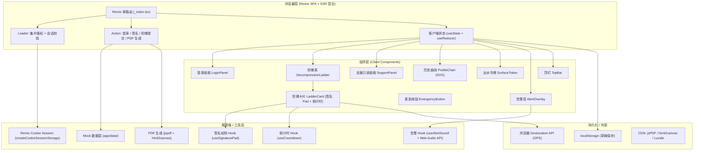
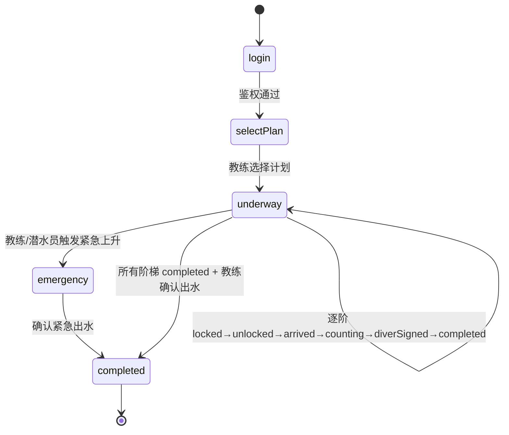

## 1. 架构设计



## 2. 技术描述

- **前端框架**：Remix@2 (React 18 + TypeScript) — 单路由设计，流程线性无深链，loader 集中鉴权
- **样式方案**：Tailwind CSS 3 + CSS Variables（海事控制台主题色），零 UI 库依赖，纯手写组件
- **状态管理**：`useReducer` 集中管理潜水作业状态机（idle → diving → decompressing → surfacing → emergency → completed），阶梯数据置于 reducer state 中确保单一数据源
- **初始化方式**：`npx create-remix@latest --template remix-run/remix/templates/vanilla`（手动接入 Tailwind）
- **后端**：无独立后端，使用 Remix Action + Loader + Cookie Session Storage 模拟服务端鉴权，数据落盘 localStorage
- **Mock 数据**：`app/data/mockData.ts` 内置 3 套下潜计划 + 历史 profile，5 个测试账号（潜水员×2、教练×1、支援×1、管理员×1）
- **签名组件**：原生 `<canvas>` 手写 `useSignaturePad` Hook，导出 base64 PNG 嵌入 PDF
- **倒计时**：`useCountdown` Hook 基于 `requestAnimationFrame`，支持暂停/恢复/偏离检测（超计划±3min 告警）
- **PDF 生成**：`jspdf` + `html2canvas` 客户端生成，嵌入海事范本表头、阶梯表、签名图片、GPS 坐标
- **告警音**：Web Audio API 原生合成蜂鸣音（无音频文件依赖）
- **图表**：原生 SVG 手写折线图，无 D3/Recharts 依赖，支持历史曲线叠加
- **字体**：Google Fonts CDN 引入 `JetBrains Mono` + `Noto Sans SC`

## 3. 路由定义

| 路由 | 目的 | Loader 职责 | Action 职责 |
|------|------|------------|------------|
| `/` (单路由 _index.tsx) | 登录 + 主核对台 全部流程 | 校验 session 角色，未登录注入 `mode: "login"`，已登录注入当前潜水作业 state + mock 数据 | `intent: "login"` 登录；`intent: "sign"` 阶梯签名；`intent: "checkin"` 勾选到达时刻；`intent: "emergency"` 紧急模式；`intent: "surface"` 确认出水；`intent: "export"` 生成并返回 PDF Blob |

> 设计说明：用户明确要求「Remix 单路由，因流程线性无深链，loader 集中鉴权更简单」。通过 `state.mode` 在同一页面切换登录态 / 作业态，无任何嵌套路由。

## 4. 数据模型与状态定义

### 4.1 核心 TS 类型

```typescript
// 用户与鉴权
type Role = "diver" | "instructor" | "support" | "admin";

interface User {
  id: string;
  employeeId: string;       // 工号
  name: string;
  role: Role;
  password: string;         // mock 明文
}

interface Session {
  userId: string;
  loginAt: number;
}

// 减压阶梯
interface DecompressionStep {
  id: string;
  index: number;            // 0 = 最深, N = 水面（0m）
  plannedDepth: number;     // 计划深度（米）
  plannedDuration: number;  // 计划停留（秒）
  status: "locked"          // 未解锁（上级未完成）
         | "unlocked"       // 已解锁，等待到达
         | "arrived"        // 潜水员已勾选到达时刻
         | "counting"       // 倒计时进行中
         | "diverSigned"    // 潜水员已签
         | "completed"      // 教练副签完成
         | "skipped";       // 紧急模式跳过

  actualArrivalTime?: number;  // 实际到达时间戳
  gpsLat?: number;
  gpsLng?: number;
  diverSignature?: string;     // base64 PNG
  diverSignTime?: number;
  instructorSignature?: string;
  instructorSignTime?: number;
  deviationSeconds?: number;   // 偏离值，正=超时，负=提前
  hasAlert?: boolean;          // 是否触发过 3min 偏离告警
}

// 下潜计划
interface DivePlan {
  id: string;
  siteName: string;
  maxDepth: number;
  plannedStartTime: number;
  steps: DecompressionStep[];
}

// 历史 Dive Profile（用于灰线比对）
interface HistoricalProfile {
  id: string;
  date: string;
  siteName: string;
  points: { depth: number; time: number }[]; // time 为相对下潜开始的秒数
}

// 全局作业状态
type DiveMode = "login" | "selectPlan" | "underway" | "emergency" | "completed";

interface DiveState {
  mode: DiveMode;
  currentStepId: string | null;
  plan: DivePlan | null;
  alerts: Alert[];
  emergencyReason?: string;
  surfacedAt?: number;
}

interface Alert {
  id: string;
  type: "deviation" | "countdown_end" | "emergency";
  stepId: string;
  message: string;
  createdAt: number;
  acknowledged: boolean;
}
```

### 4.2 状态机转换规则



**关键业务规则（reducer 中强制校验）：**
1. 阶梯 N.status 必须为 `completed` 才允许阶梯 N+1 从 `locked` → `unlocked`
2. `arrived` 必须由 Role==="diver" 的当前登录用户操作，Role 不匹配直接丢弃 action
3. `diverSignature` 必须由对应潜水员账号签署，教练操作直接拦截
4. `instructorSignature` 必须由 Role==="instructor" 签署，潜水员操作直接拦截
5. 未全部阶梯为 `completed` 且非 emergency 模式下，`surface` action 被拒绝
6. `deviationSeconds` > 180（3 分钟）→ 自动创建 Alert + hasAlert=true
7. emergency 模式下，所有未完成阶梯一次性标记为 `skipped`

## 5. 测试账号（Mock 数据）

| 工号 | 密码 | 角色 | 姓名 |
|------|------|------|------|
| DV001 | 123456 | diver | 陈海峰 |
| DV002 | 123456 | diver | 李深蓝 |
| IR001 | 123456 | instructor | 王教练 |
| SP001 | 123456 | support | 赵支援 |
| AD001 | 123456 | admin | 管理员 |

## 6. 关键文件结构

```
app/
├── root.tsx                    # Remix 根，全局样式注入 + 字体
├── entry.client.tsx
├── entry.server.tsx
├── routes/
│   └── _index.tsx              # ★ 单路由：loader 鉴权 + action + UI 组合
├── data/
│   ├── mockData.ts             # 用户 / 下潜计划 / 历史 profile
│   └── session.server.ts       # createCookieSessionStorage 封装
├── hooks/
│   ├── useSignaturePad.ts      # canvas 签名 Hook
│   ├── useCountdown.ts         # 倒计时 + 偏离检测
│   ├── useAlertSound.ts        # Web Audio 蜂鸣
│   └── useDiveReducer.ts       # 状态机 reducer Hook
├── components/
│   ├── LoginPanel.tsx
│   ├── PlanSelector.tsx
│   ├── TopBar.tsx
│   ├── DecompressionLadder.tsx
│   ├── LadderCard.tsx          # ★ 核心：逐级解锁 + 签名双区 + 倒计时
│   ├── SupportPanel.tsx
│   ├── ProfileChart.tsx        # SVG 折线图 + 历史灰线叠加
│   ├── EmergencyButton.tsx
│   ├── SurfaceToken.tsx        # ★ 可出水令牌门控
│   ├── AlertOverlay.tsx
│   └── SignaturePad.tsx        # 签名 canvas 组件封装
├── utils/
│   ├── pdfGenerator.ts         # jsPDF 海事范本生成
│   ├── gps.ts                  # navigator.geolocation 封装
│   └── format.ts               // 时间 / 深度格式化
└── styles/
    └── tailwind.css            # Tailwind 指令 + 主题 CSS 变量
```

## 7. 关键技术实现要点

### 7.1 Loader 集中鉴权模式
```typescript
// routes/_index.tsx
export const loader = async ({ request }: LoaderFunctionArgs) => {
  const session = await getSession(request.headers.get("Cookie"));
  const userId = session.get("userId");
  if (!userId) {
    return json({ mode: "login" as const, user: null, state: null });
  }
  const user = users.find(u => u.id === userId);
  // 从 localStorage / mock 恢复当前潜水作业 state
  const diveState = await loadDiveState(userId);
  return json({ mode: "underway", user, diveState, plans, historicalProfiles });
};
```

### 7.2 签名防代签机制
- 每个 `LadderCard` 渲染时读取当前 `useLoaderData().user.role`
- 潜水员签名按钮仅在 `role === "diver"` 且 `user.id === 该阶梯分配的潜水员 ID` 时启用
- 教练签名按钮仅在 `role === "instructor"` 时启用
- Action 层二次校验（防前端篡改）：`formData` 中附带签名者 userId，服务端与 session 对比不一致直接返回 403

### 7.3 倒计时偏离检测
`useCountdown(plannedDuration, step.status)` 每 500ms 校准一次 `performance.now()`：
- `elapsed - plannedDuration > 180s` → dispatch `TRIGGER_ALERT`
- `elapsed - plannedDuration > 30s` → 倒计时数字变黄
- `elapsed > plannedDuration` → 数字变红 + 每秒脉冲动画

### 7.4 PDF 海事范本结构
```
[页眉] 海事局潜水作业减压日志 / 编号 / 潜点 / GPS
[表体] 阶梯表（深度 / 计划时长 / 实际到达 / GPS / 偏离 / 潜水员签名图 / 教练签名图）
[页脚] 可出水令牌编号 / 教练总签 / 紧急事件备注（如有）
```
通过 `jspdf` 直接定位坐标绘制，不依赖 HTML 快照，确保精确打印布局。
