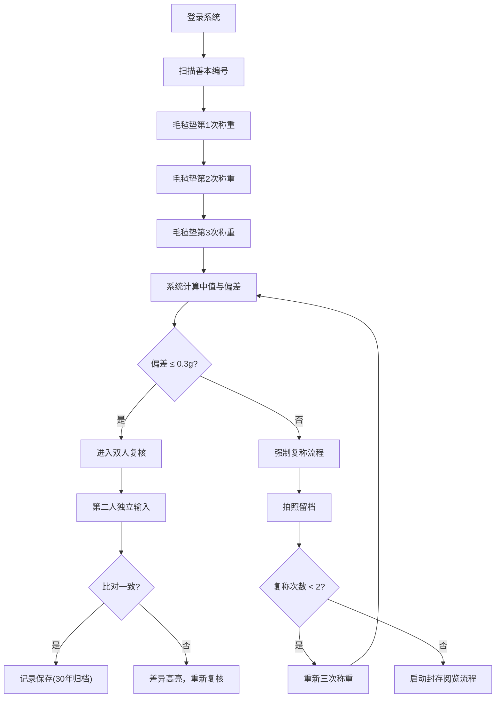

# 善本毛毡称重台 - 产品需求文档

## 1. 产品概述

「善本毛毡称重台」是为省图书馆善本库房定制开发的高精度纸张湿度测量系统。针对 2024 年湿度失控事件中"纸页含水凭手感记录不可追溯"的纪检认定问题，采用毛毡垫称重法实现纸页湿度的可量化、可追溯测量。

- **解决问题**：消除人工手感判断的主观性与不可追溯性，解决戴棉手套无法精确点选 iPad 小数点的操作痛点
- **目标用户**：善本库房管理员、文献修复师、典藏管理人员
- **合规要求**：称重记录保存期限不少于 30 年，复称两次仍超阈自动启动「封存阅览」流程

---

## 2. 核心功能

### 2.1 用户角色

| 角色 | 注册方式 | 核心权限 |
|------|----------|----------|
| 称重操作员 | 工号登录 | 执行称重流程、录入数据、拍照留档 |
| 复核员 | 工号登录 | 双人复核第二人独立输入、比对结果 |
| 库房管理员 | 工号登录 | 查看称重记录、导出 CSV、启动封存流程 |
| 系统管理员 | 管理员账号 | 配置温湿度探针、设置阈值参数、数据归档 |

### 2.2 功能模块

1. **称重主流程页面**：毛毡垫称重法核心流程，三次读数取中值
2. **温湿度监控模块**：实时绑定库房温湿度探针读数
3. **异常处理模块**：偏差超 0.3g 强制复称、脱酸工单预约、封存阅览流程
4. **数据可视化模块**：7 日称重曲线滚动小图
5. **双人复核模块**：第二人独立输入比对机制
6. **数据导出模块**：CSV 导出对接典藏管理系统
7. **历史记录查询**：称重记录检索与 30 年归档管理

### 2.3 页面详情

| 页面名称 | 模块名称 | 功能描述 |
|---------|----------|----------|
| 称重主页面 | 称重操作区 | 三次称重输入、中值自动计算、大按钮设计适配棉手套操作 |
| 称重主页面 | 复称流程 | 偏差超 0.3g 强制复称、拍照留档、复称两次超阈触发封存 |
| 称重主页面 | 温湿度绑定 | 每次称重自动获取并绑定库房温湿度探针读数 |
| 称重主页面 | 异常工单 | 异常页自动预约脱酸工单、状态跟踪 |
| 称重主页面 | 曲线展示 | 7 日称重数据滚动小图、趋势分析 |
| 复核页面 | 双人复核 | 第二人独立输入、系统自动比对、差异高亮 |
| 记录管理 | 历史查询 | 按善本编号、日期、操作员检索记录 |
| 记录管理 | CSV 导出 | 导出标准格式对接典藏管理系统 |
| 封存流程 | 封存阅览 | 复称两次超阈自动启动封存、审批流转 |

---

## 3. 核心流程

### 3.1 主称重流程

操作员登录系统 → 扫描善本编号 → 毛毡垫法三次称重 → 系统自动取中值 → 自动绑定温湿度 → 检查偏差（≤0.3g）→ 进入双人复核 → 第二人独立输入 → 系统比对一致 → 记录保存（30年归档）

### 3.2 异常处理流程

偏差超阈 → 强制复称 → 拍照留档 → 复称仍超阈 → 第二次复称 → 仍超阈 → 自动启动「封存阅览」流程 → 通知库房管理员 → 生成脱酸工单预约

---

## 4. 用户界面设计

### 4.1 设计风格

- **设计定位**：专业、严谨、可信赖的工业级界面，体现文物保护的专业性与历史厚重感
- **主色调**：深胡桃木色 `#4A3728` 作为主色（呼应古籍文献的历史感），配以象牙白 `#F5F0E8` 背景
- **辅助色**：朱砂红 `#B33A3A` 用于异常警示，石青蓝 `#2C5F7C` 用于数据图表，松绿 `#3D6B4F` 用于正常状态
- **按钮设计**：超大圆角矩形按钮（最小 60x60px），适配戴棉手套操作，避免小数点误触
- **字体**：标题用「思源宋体」体现文化底蕴，数字与输入框用「等宽字体」确保称重读数精确对齐
- **布局风格**：卡片式分区布局，清晰的流程指引线，重要数据（称重值、偏差）放大显示
- **交互优化**：所有需要精确输入的数值采用「滚轮选择器」替代键盘输入，避免小数点误触

### 4.2 页面设计概述

| 页面名称 | 模块名称 | UI 元素 |
|---------|----------|---------|
| 称重主页面 | 称重操作区 | 超大数字显示屏（3位小数）、滚轮选择器输入、三次称重卡片横向排列 |
| 称重主页面 | 偏差指示器 | 动态仪表盘显示偏差值，0-0.3g 绿色渐变，超阈红色闪烁 |
| 称重主页面 | 温湿度面板 | 实时温湿度卡片，带有探针在线状态指示灯 |
| 称重主页面 | 7日曲线图 | 底部滚动小图，显示近期称重趋势，支持滑动查看 |
| 复核页面 | 双人比对 | 左右分栏对比，操作员输入 vs 复核员输入，差异项高亮闪烁 |
| 异常页面 | 封存流程 | 深红色警告横幅，流程步骤指示器，审批意见输入区 |

### 4.3 响应性设计

- **桌面优先**：适配库房固定工作站 27 寸显示器
- **平板适配**：iPad Pro 12.9寸横向使用，按钮进一步放大，确保戴棉手套可精确操作
- **触控优化**：所有可点击元素最小尺寸 48x48px，关键操作按钮 60x60px
- **输入优化**：取消键盘输入，全部采用滚轮选择器、大按钮步进器等触控友好的输入方式

### 4.4 无障碍设计

- 高对比度配色（WCAG AA 级）
- 关键操作语音反馈
- 称重完成/异常时的声光提示
- 字体大小可调节

---

## 5. 业务约束与合规要求

### 5.1 称量规则

- 必须完成三次称重，取中值作为最终结果
- 三次称重偏差超过 0.3g 必须复称
- 每次称重必须绑定当时的库房温湿度探针读数
- 称重数据不可修改，仅可追加复称记录

### 5.2 复核规则

- 第二人必须独立输入，不可查看第一人输入结果
- 系统自动比对，差异超过 0.1g 必须重新复核
- 复核记录独立保存，与称重记录关联

### 5.3 归档规则

- 所有称重记录、复核记录、照片、温湿度数据永久保存（不少于 30 年）
- 数据不可删除，仅可标记为「已归档」
- 每年自动生成归档报表，对接典藏管理系统

### 5.4 异常规则

- 复称 2 次后偏差仍超 0.3g，自动启动「封存阅览」流程
- 异常页自动生成脱酸工单预约
- 所有异常流程必须有照片留档
