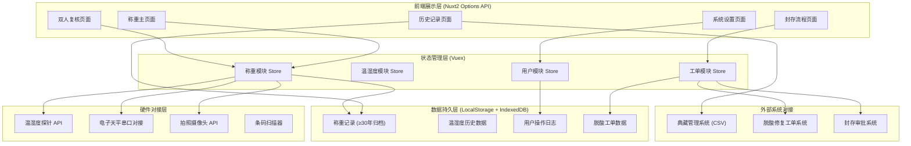
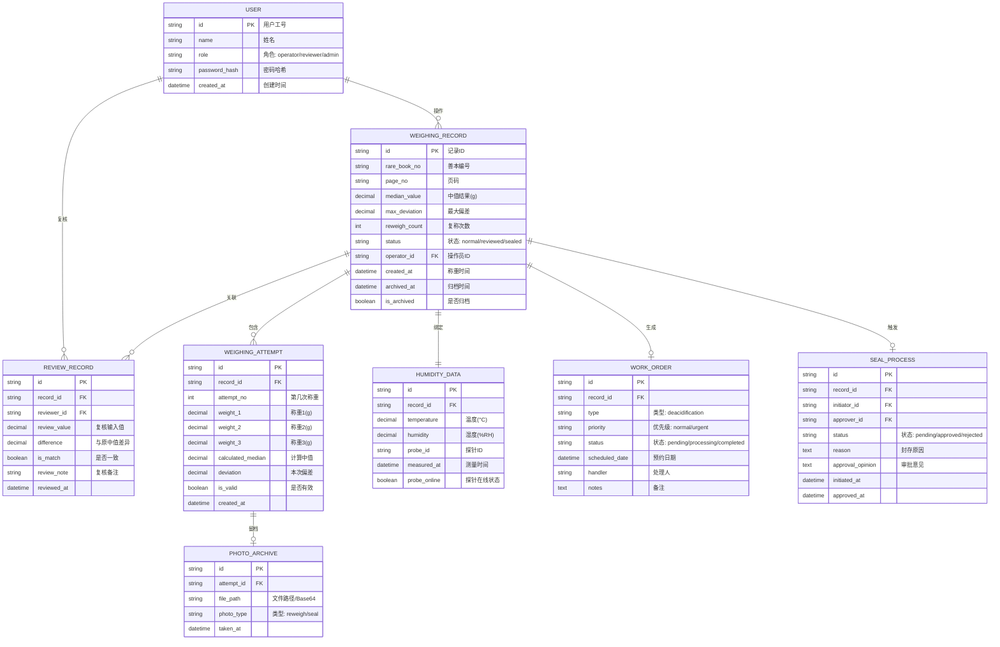

# 善本毛毡称重台 - 技术架构文档

## 1. 架构设计



---

## 2. 技术选型说明

| 技术项 | 选型 | 说明 |
|--------|------|------|
| 前端框架 | **Nuxt 2.17.x + Vue 2.7.x** | 团队遗留代码量大，IE 插件仅 v2 可用，Options API 强制要求 |
| 状态管理 | **Vuex 3.6.x** | Nuxt2 生态原生支持，模块式管理称重、温湿度、工单状态 |
| UI 框架 | **Element UI 2.15.x** | IE 兼容良好，组件丰富，适合企业级应用 |
| 图表库 | **Chart.js 2.9.x** | 轻量级，IE11 兼容，满足 7 日滚动曲线图需求 |
| 数据持久化 | **LocalStorage + IndexedDB** | 前端本地存储 ≥30 年归档需求，支持大量历史数据 |
| CSV 导出 | **Papaparse 5.4.x** | 高性能 CSV 解析/导出，对接典藏管理系统 |
| 样式方案 | **SCSS + CSS Variables** | 主题色统一管理，响应式适配桌面与平板 |
| 日期处理 | **Day.js 1.11.x** | 轻量级 Moment.js 替代品，国际化支持 |
| 构建工具 | **Webpack 4.x** | Nuxt2 内置，确保 IE 兼容性 |
| 浏览器兼容 | **IE11+, Chrome 80+, Safari 13+** | 满足库房旧设备与 iPad 需求 |

### 关键约束

- **强制使用 Options API**：禁止 Composition API，保持与团队遗留代码一致
- **禁止引入 Vue 3 生态库**：所有依赖必须明确支持 Vue 2 + IE11
- **数值输入方案**：自研滚轮选择器组件，彻底解决戴棉手套无法点选小数点问题

---

## 3. 路由定义

| 路由路径 | 页面名称 | 页面组件 | 权限要求 |
|---------|----------|----------|----------|
| `/` | 首页/称重台主页 | `pages/index.vue` | 称重操作员 |
| `/weighing` | 称重主流程 | `pages/weighing/index.vue` | 称重操作员 |
| `/weighing/review` | 双人复核页面 | `pages/weighing/review.vue` | 复核员 |
| `/weighing/seal` | 封存阅览流程 | `pages/weighing/seal.vue` | 库房管理员 |
| `/records` | 历史记录查询 | `pages/records/index.vue` | 库房管理员 |
| `/records/export` | CSV 导出 | `pages/records/export.vue` | 库房管理员 |
| `/workorders` | 脱酸工单管理 | `pages/workorders/index.vue` | 库房管理员 |
| `/settings` | 系统设置 | `pages/settings/index.vue` | 系统管理员 |
| `/login` | 登录页面 | `pages/login.vue` | 公开 |

---

## 4. 数据模型定义

### 4.1 实体关系图



### 4.2 数据持久化策略

1. **热数据（近 1 年）**：IndexedDB 存储，支持快速查询与图表渲染
2. **温数据（1-10 年）**：LocalStorage 分片压缩存储
3. **冷数据（10 年以上）**：导出为加密 JSON + CSV 双格式，提示用户备份至典藏系统
4. **索引策略**：按善本编号、日期范围、操作员建立多字段索引
5. **防篡改机制**：每条记录生成 SHA-256 哈希，修改时校验哈希链

---

## 5. 核心模块设计

### 5.1 称重核心算法 (`utils/weighing.js`)

```javascript
// 计算中值
export function calculateMedian(values) {
  const sorted = [...values].sort((a, b) => a - b)
  return sorted[1] // 三次取中
}

// 计算最大偏差
export function calculateDeviation(values, median) {
  return Math.max(...values.map(v => Math.abs(v - median)))
}

// 判断是否需要复称
export function needsReweigh(deviation, threshold = 0.3) {
  return deviation > threshold
}

// 复核比对
export function reviewMatch(original, review, threshold = 0.1) {
  return Math.abs(original - review) <= threshold
}
```

### 5.2 Store 模块结构

```
store/
├── weighing.js      # 称重状态管理
├── humidity.js      # 温湿度探针状态
├── user.js          # 用户登录与权限
├── workorder.js     # 脱酸工单管理
└── seal.js          # 封存流程管理
```

### 5.3 核心组件结构

```
components/
├── weighing/
│   ├── WeightInputPad.vue      # 大按钮数字输入键盘
│   ├── WheelNumberPicker.vue   # 滚轮选择器（解决小数点问题）
│   ├── WeighingCard.vue        # 单条称重卡片
│   ├── DeviationGauge.vue      # 偏差仪表盘
│   └── ReweighModal.vue        # 复称弹窗
├── humidity/
│   ├── ProbeStatusCard.vue     # 温湿度探针状态卡
│   └── HumidityTrendChart.vue  # 7日滚动曲线图
├── review/
│   └── DualComparePanel.vue    # 双人比对面板
├── common/
│   ├── PhotoCapture.vue        # 拍照留档组件
│   └── BarcodeScanner.vue      # 条码扫描组件
└── export/
    └── CsvExportButton.vue     # CSV 导出按钮
```

---

## 6. 合规与安全设计

### 6.1 操作日志

- 所有用户操作（登录、称重、修改、导出）均记录审计日志
- 日志包含：用户ID、操作类型、时间戳、IP地址、操作前后数据
- 日志不可删除、不可修改

### 6.2 数据完整性

- 每条称重记录生成数字签名
- 数据导出时附带完整性校验码
- 定期（每日）自动校验数据完整性

### 6.3 30 年归档保证

- 数据格式：采用 UTF-8 编码的 JSON + CSV 双格式
- 存储介质：前端 IndexedDB + 用户定期备份到典藏系统
- 格式说明：随导出文件附带格式说明文档，确保 30 年后仍可解析

---

## 7. 项目目录结构

```
/
├── assets/
│   ├── scss/
│   │   ├── _variables.scss     # 设计变量（胡桃木色、朱砂红等）
│   │   ├── _mixins.scss
│   │   └── main.scss
│   └── fonts/                  # 思源宋体、等宽字体
├── components/                 # 见 5.3 节
├── layouts/
│   ├── default.vue
│   └── login.vue
├── pages/                      # 见路由定义
├── plugins/
│   ├── element-ui.js
│   ├── dayjs.js
│   └── indexed-db.js           # IndexedDB 初始化
├── store/                      # 见 5.2 节
├── utils/
│   ├── weighing.js             # 称重核心算法
│   ├── csv.js                  # CSV 导出工具
│   ├── crypto.js               # 哈希与签名工具
│   └── validator.js            # 业务规则校验
├── static/
├── nuxt.config.js
├── package.json
└── .babelrc                    # IE11 兼容配置
```
