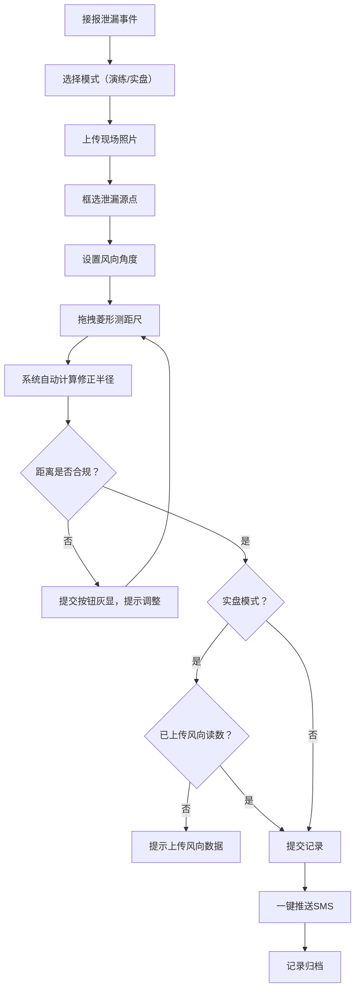

# 危化菱形测距端 产品需求文档

## 1. 产品概述

危化菱形测距端是化工园区泄漏应急处置的专业测距工具，解决传统隔离带目测画圈、风向突变警戒距离不足的安全隐患。支持菱形标签四向拖拽测距、风向扇形自动修正、违规距离禁止提交等核心功能，适配展示型录入 kiosk 离线 CDN 运行场景。

- 解决问题：化工园区泄漏演练隔离带靠目测画圈，风向突变后警戒距离不足
- 目标用户：应急处置人员、仓管员、安全监管人员
- 核心价值：精准测距、风向自动修正、合规校验、数据分级管理

## 2. 核心功能

### 2.1 功能模块

1. **菱形测距面板**：四向拖拽测距尺、实时距离计算、隔离半径显示
2. **风向修正模块**：风向扇形叠加、自动修正半径、风向角度调节
3. **现场取证模块**：照片上传、泄漏源点框选、源点坐标记录
4. **模式切换模块**：演练/实盘模式切换、水印区分、数据隔离
5. **合规校验模块**：违规距离检测、提交按钮灰显、实盘风向必填
6. **历史记录模块**：历史泄漏圈半透明叠加、地图展示、历史回溯
7. **通知推送模块**：一键 SMS 推送、周边企业列表、推送记录

### 2.2 功能详情

| 页面/模块 | 功能名称 | 功能描述 |
|-----------|----------|----------|
| 菱形测距 | 四向拖拽 | 菱形四个顶点支持独立拖拽，实时计算各向距离 |
| 菱形测距 | 距离显示 | 显示东/南/西/北四向距离及平均隔离半径 |
| 风向修正 | 扇形叠加 | 以泄漏源为顶点，沿风向方向绘制扩散扇形 |
| 风向修正 | 自动修正 | 下风向距离自动放大，上风向距离缩小 |
| 风向修正 | 角度调节 | 支持 0-360° 风向角度调节，扇形实时更新 |
| 现场取证 | 照片上传 | 支持上传现场照片，支持触屏/手套操作 |
| 现场取证 | 源点框选 | 在照片上点击/拖拽标记泄漏源点位置 |
| 模式切换 | 模式切换 | 演练模式与实盘模式一键切换 |
| 模式切换 | 水印区分 | 演练模式显示"演练"水印，实盘模式无水印 |
| 模式切换 | 数据隔离 | 演练数据不写入监管正式库 |
| 合规校验 | 距离校验 | 检测隔离距离是否达标，不达标禁止提交 |
| 合规校验 | 按钮灰显 | 违规时提交按钮保持灰显不可点击 |
| 合规校验 | 风向校验 | 实盘模式未上传风向读数禁止提交 |
| 历史记录 | 历史叠加 | 历史泄漏圈半透明叠加在当前地图上 |
| 历史记录 | 地图展示 | 支持地图模式查看历史泄漏范围 |
| 通知推送 | SMS 推送 | 一键向周边企业发送安全通知短信 |
| 通知推送 | 企业列表 | 展示周边企业名称及联系方式 |

## 3. 核心流程

### 3.1 应急处置流程

### 3.2 菱形测距逻辑

## 4. 用户界面设计

### 4.1 设计风格

- **设计理念**：工业级安全工具，专业严谨，高对比度，操作便捷
- **主色调**：警示橙 (#FF6B35) 作为主色，代表危险警示
- **辅助色**：安全绿 (#2ECC71) 表示合规，警示红 (#E74C3C) 表示违规
- **中性色**：深灰 (#1A1A2E) 背景，浅灰 (#E8E8E8) 文字，确保高对比度
- **按钮风格**：方中带圆（4px 圆角），实心按钮，按压态明显
- **字体**：系统无衬线字体，数字使用等宽字体确保读数清晰
- **布局风格**：顶部工具栏 + 中央画布 + 右侧参数面板，三栏布局
- **图标风格**：线性图标，2px 描边，工业感强

### 4.2 页面设计概览

| 页面/模块 | UI 元素 | 布局特点 | 动效说明 |
|-----------|---------|----------|----------|
| 测距主界面 | 顶部模式切换、中央画布、右侧参数面板 | 三栏布局，画布自适应 | 菱形拖拽实时跟随，扇形平滑过渡 |
| 照片上传 | 上传区域、预览框、源点标记工具 | 左右分栏，左侧操作右侧预览 | 拖拽上传有吸附动效 |
| 历史记录 | 时间轴列表、地图叠加层 | 左侧列表 + 右侧地图 | 点击历史记录淡入叠加层 |
| SMS 推送 | 企业列表、推送按钮、状态提示 | 列表 + 底部操作栏 | 推送成功有脉冲动效 |

### 4.3 响应式设计

- **桌面端（kiosk）**：三栏布局，大触控目标，适合手套操作
- **平板端**：两栏布局，参数面板可收起
- **触控优化**：按钮最小高度 48px，拖拽区域放大 20px 热区

### 4.4 特殊交互设计

- **手套友好**：所有可交互元素增大触控热区，避免电容屏滑块
- **离线可用**：纯前端计算，CDN 部署即可运行
- **高对比度**：确保户外强光下可读
