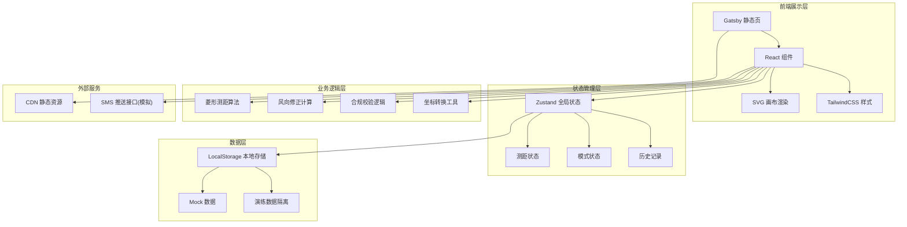

# 危化菱形测距端 技术架构文档

## 1. 架构设计



## 2. 技术选型说明

| 分类 | 技术 | 版本 | 说明 |
|------|------|------|------|
| 框架 | Gatsby | 5.x | 静态站点生成器，支持离线 CDN 部署 |
| 语言 | TypeScript | 5.x | 类型安全，提升代码可维护性 |
| UI | React | 18.x | 组件化开发 |
| 样式 | TailwindCSS | 3.x | 原子化 CSS，快速构建界面 |
| 状态管理 | Zustand | 4.x | 轻量级状态管理，适合离线应用 |
| 图形渲染 | SVG | - | 矢量绘图，支持拖拽交互 |
| 图标 | lucide-react | 0.3.x | 线性图标库 |
| 构建 | Vite (Gatsby 底层) | - | 快速构建 |

## 3. 项目结构

```
.
├── src/
│   ├── components/          # 组件目录
│   │   ├── DiamondRuler/    # 菱形测距组件
│   │   ├── WindFan/         # 风向扇形组件
│   │   ├── PhotoMarker/     # 照片标记组件
│   │   ├── ModeSwitch/      # 模式切换组件
│   │   ├── SubmitButton/    # 提交按钮组件
│   │   ├── HistoryOverlay/  # 历史叠加组件
│   │   └── SmsPush/         # SMS推送组件
│   ├── hooks/               # 自定义 Hooks
│   │   ├── useDrag.ts       # 拖拽 Hook
│   │   └── useMeasure.ts    # 测距 Hook
│   ├── store/               # 状态管理
│   │   └── useAppStore.ts   # 全局 Store
│   ├── utils/               # 工具函数
│   │   ├── distance.ts      # 距离计算
│   │   ├── wind.ts          # 风向修正
│   │   └── validation.ts    # 合规校验
│   ├── types/               # 类型定义
│   │   └── index.ts         # 类型声明
│   ├── data/                # Mock 数据
│   │   ├── history.ts       # 历史记录数据
│   │   └── enterprises.ts   # 周边企业数据
│   └── pages/               # 页面
│       └── index.tsx        # 首页
├── gatsby-config.ts         # Gatsby 配置
├── tailwind.config.js       # Tailwind 配置
├── tsconfig.json            # TypeScript 配置
└── package.json             # 项目依赖
```

## 4. 核心数据模型

### 4.1 菱形测距数据

```typescript
interface DiamondPoint {
  x: number;       // 相对坐标 (0-100)
  y: number;
  direction: 'north' | 'south' | 'east' | 'west';
}

interface DiamondMeasure {
  center: { x: number; y: number };
  north: DiamondPoint;
  south: DiamondPoint;
  east: DiamondPoint;
  west: DiamondPoint;
  distances: {
    north: number;    // 米
    south: number;
    east: number;
    west: number;
    average: number;
  };
}
```

### 4.2 风向数据

```typescript
interface WindData {
  angle: number;          // 0-360度，0度为正北
  speed: number;          // 风速 m/s
  fanAngle: number;       // 扇形扩散角度
  correctionFactor: {
    upwind: number;       // 上风向修正系数
    downwind: number;     // 下风向修正系数
    crosswind: number;    // 侧风向修正系数
  };
}
```

### 4.3 模式状态

```typescript
type AppMode = 'drill' | 'real';

interface ModeState {
  mode: AppMode;
  hasWindReading: boolean;  // 实盘模式下是否已上传风向读数
  isSubmitted: boolean;
}
```

### 4.4 历史记录

```typescript
interface HistoryRecord {
  id: string;
  timestamp: number;
  mode: AppMode;
  location: string;
  leakSource: { x: number; y: number };
  diamond: DiamondMeasure;
  wind: WindData;
  correctedRadius: number;
  isCompliant: boolean;
  photoUrl?: string;
}
```

### 4.5 合规校验结果

```typescript
interface ValidationResult {
  isValid: boolean;
  errors: string[];
  warnings: string[];
  minRequiredDistance: number;
  actualMinDistance: number;
}
```

## 5. 核心算法

### 5.1 菱形距离计算

```
各向距离 = 顶点与中心点的像素距离 × 比例尺
平均距离 = (北 + 南 + 东 + 西) / 4
```

### 5.2 风向修正算法

```
风向角度 θ = 输入风向（0-360°）
某方向与风向夹角 α = |方向角度 - θ|

修正系数 k：
- α < 30°（下风向）: k = 1.5 ~ 2.0
- 30° ≤ α < 60°（侧下风向）: k = 1.2 ~ 1.5
- 60° ≤ α < 120°（侧风向）: k = 1.0
- 120° ≤ α < 150°（侧上风向）: k = 0.8 ~ 0.9
- α ≥ 150°（上风向）: k = 0.5 ~ 0.7

修正后距离 = 原始距离 × k
```

### 5.3 合规判定

```
合规条件：
1. 修正后最小距离 ≥ 安全阈值（默认 500 米）
2. 实盘模式必须已上传风向读数
3. 已标记泄漏源点
4. 已上传现场照片（实盘模式）
```

## 6. 数据存储策略

- **演练数据**：仅存储在 localStorage，标记为 drill 类型，不参与正式统计
- **实盘数据**：存储在 localStorage，标记为 real 类型，可导出
- **数据隔离**：通过 mode 字段区分，查询时默认分离
- **离线支持**：全部数据本地存储，无需后端服务

## 7. 性能优化

- SVG 局部重绘，仅更新变化的顶点
- 使用 requestAnimationFrame 平滑拖拽
- 防抖处理距离计算
- 历史记录懒加载，按需渲染叠加层
