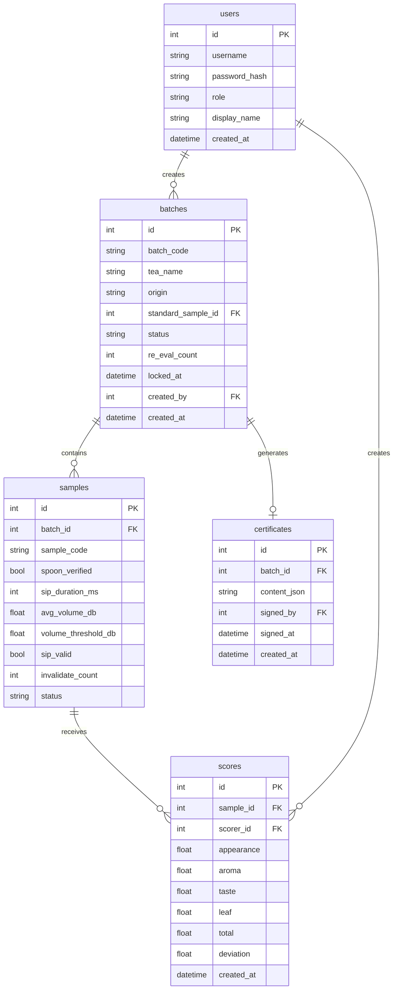

## 1. 架构设计

```mermaid
graph TB
    subgraph "前端层"
        "浏览器" --> "HTMX"
        "浏览器" --> "hyperscript"
        "浏览器" --> "Tailwind CSS"
        "浏览器" --> "Web Audio API"
    end
    subgraph "后端层"
        "Express.js" --> "路由层"
        "路由层" --> "业务逻辑层"
        "业务逻辑层" --> "数据访问层"
    end
    subgraph "数据层"
        "SQLite" --> "better-sqlite3"
    end
    "HTMX" -->|AJAX 请求| "Express.js"
    "Express.js" -->|HTML 片段| "HTMX"
```

## 2. 技术说明

- 前端：HTMX 2.x + hyperscript 0.9 + Tailwind CSS 3.x（服务端渲染 HTML 片段，无 SPA）
- 初始化工具：手动搭建（HTMX 不适用 Vite SPA 模板）
- 后端：Express 4.x + TypeScript（ESM）
- 数据库：SQLite（better-sqlite3），文件存储，零运维
- 音频采集：浏览器 Web Audio API + getUserMedia，音量计算在前端完成，阈值判定结果传回后端
- 模板引擎：原生 HTML 模板片段，Express 返回局部 HTML

## 3. 路由定义

| 路由 | 用途 |
|------|------|
| GET / | 重定向到登录页 |
| GET /login | 登录页面 |
| POST /login | 登录认证 |
| GET /dashboard | 批次仪表盘 |
| POST /batches | 创建批次 |
| GET /cupping/:batchId | 杯测审评室 |
| POST /cupping/:batchId/sample/:sampleId/verify-spoon | 勺量校验确认 |
| POST /cupping/:batchId/sample/:sampleId/start-sip | 开始啜饮（计时器启动） |
| POST /cupping/:batchId/sample/:sampleId/end-sip | 结束啜饮（提交音量数据） |
| POST /cupping/:batchId/sample/:sampleId/score | 提交四轴评分 |
| POST /cupping/:batchId/sample/:sampleId/invalidate | 作废样本 |
| POST /cupping/:batchId/lock | 锁定批次 |
| GET /cupping/:batchId/certificate | 查看证书草稿 |
| POST /cupping/:batchId/certificate/sign | 主评签发 |
| GET /api/batches | 批次列表（HTMX 片段） |
| GET /api/cupping/:batchId/timer | 计时器片段 |
| GET /api/cupping/:batchId/volume | 音量状态片段 |

## 4. API 定义

```typescript
interface User {
  id: number;
  username: string;
  password_hash: string;
  role: "chief" | "assistant" | "admin";
  display_name: string;
  created_at: string;
}

interface Batch {
  id: number;
  batch_code: string;
  tea_name: string;
  origin: string;
  standard_sample_id: number | null;
  status: "pending" | "in_progress" | "locked" | "downgraded";
  re_eval_count: number;
  locked_at: string | null;
  created_by: number;
  created_at: string;
}

interface Sample {
  id: number;
  batch_id: number;
  sample_code: string;
  spoon_verified: boolean;
  sip_duration_ms: number | null;
  avg_volume_db: number | null;
  volume_threshold_db: number;
  sip_valid: boolean | null;
  invalidate_count: number;
  status: "pending" | "sipping" | "scored" | "invalid";
}

interface Score {
  id: number;
  sample_id: number;
  scorer_id: number;
  appearance: number;
  aroma: number;
  taste: number;
  leaf: number;
  total: number;
  deviation: number;
  created_at: string;
}

interface Certificate {
  id: number;
  batch_id: number;
  content_json: string;
  signed_by: number | null;
  signed_at: string | null;
  created_at: string;
}

interface SipResult {
  sample_id: number;
  duration_ms: number;
  avg_volume_db: number;
  peak_volume_db: number;
  threshold_db: number;
  is_valid: boolean;
}
```

## 5. 服务器架构图

```mermaid
graph LR
    "Router" --> "AuthMiddleware"
    "AuthMiddleware" --> "CuppingController"
    "CuppingController" --> "CuppingService"
    "CuppingService" --> "BatchRepository"
    "CuppingService" --> "SampleRepository"
    "CuppingService" --> "ScoreRepository"
    "BatchRepository" --> "SQLite"
    "SampleRepository" --> "SQLite"
    "ScoreRepository" --> "SQLite"
```

## 6. 数据模型

### 6.1 数据模型定义



### 6.2 数据定义语言

```sql
CREATE TABLE users (
  id INTEGER PRIMARY KEY AUTOINCREMENT,
  username TEXT NOT NULL UNIQUE,
  password_hash TEXT NOT NULL,
  role TEXT NOT NULL CHECK(role IN ('chief','assistant','admin')),
  display_name TEXT NOT NULL,
  created_at TEXT NOT NULL DEFAULT (datetime('now'))
);

CREATE TABLE batches (
  id INTEGER PRIMARY KEY AUTOINCREMENT,
  batch_code TEXT NOT NULL UNIQUE,
  tea_name TEXT NOT NULL,
  origin TEXT NOT NULL DEFAULT '',
  standard_sample_id INTEGER,
  status TEXT NOT NULL DEFAULT 'pending' CHECK(status IN ('pending','in_progress','locked','downgraded')),
  re_eval_count INTEGER NOT NULL DEFAULT 0,
  locked_at TEXT,
  created_by INTEGER NOT NULL REFERENCES users(id),
  created_at TEXT NOT NULL DEFAULT (datetime('now'))
);

CREATE TABLE samples (
  id INTEGER PRIMARY KEY AUTOINCREMENT,
  batch_id INTEGER NOT NULL REFERENCES batches(id),
  sample_code TEXT NOT NULL,
  spoon_verified INTEGER NOT NULL DEFAULT 0,
  sip_duration_ms INTEGER,
  avg_volume_db REAL,
  volume_threshold_db REAL NOT NULL DEFAULT 35.0,
  sip_valid INTEGER,
  invalidate_count INTEGER NOT NULL DEFAULT 0,
  status TEXT NOT NULL DEFAULT 'pending' CHECK(status IN ('pending','sipping','scored','invalid')),
  UNIQUE(batch_id, sample_code)
);

CREATE TABLE scores (
  id INTEGER PRIMARY KEY AUTOINCREMENT,
  sample_id INTEGER NOT NULL REFERENCES samples(id),
  scorer_id INTEGER NOT NULL REFERENCES users(id),
  appearance REAL NOT NULL CHECK(appearance >= 0 AND appearance <= 100),
  aroma REAL NOT NULL CHECK(aroma >= 0 AND aroma <= 100),
  taste REAL NOT NULL CHECK(taste >= 0 AND taste <= 100),
  leaf REAL NOT NULL CHECK(leaf >= 0 AND leaf <= 100),
  total REAL NOT NULL,
  deviation REAL NOT NULL DEFAULT 0,
  created_at TEXT NOT NULL DEFAULT (datetime('now')),
  UNIQUE(sample_id, scorer_id)
);

CREATE TABLE certificates (
  id INTEGER PRIMARY KEY AUTOINCREMENT,
  batch_id INTEGER NOT NULL REFERENCES batches(id),
  content_json TEXT NOT NULL,
  signed_by INTEGER REFERENCES users(id),
  signed_at TEXT,
  created_at TEXT NOT NULL DEFAULT (datetime('now'))
);

-- 初始用户数据
INSERT INTO users (username, password_hash, role, display_name) VALUES
  ('chief1', '$2a$10$placeholder_hash_chief1', 'chief', '主评师-陈韵'),
  ('assistant1', '$2a$10$placeholder_hash_assist1', 'assistant', '辅评师-林香'),
  ('admin', '$2a$10$placeholder_hash_admin', 'admin', '管理员');
```
