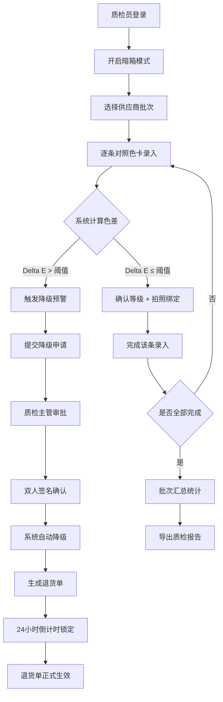

## 1. 产品概述

藏红丝线比色质检系统是一款面向进口丝线采购场景的专业质检工具，用于解决藏红等级色差争议导致的贸易索赔问题。通过标准化色卡逐条对照录入、自动色差判定、双人复核机制和全流程可追溯，实现丝线批次等级的公正判定与退货单据的合规生成。

- 核心解决：实验室比色照片与到货实物色差肉眼可见导致的等级判定争议
- 目标用户：采购部质检员、质检主管、采购经理
- 市场价值：降低因色差争议导致的百万级贸易索赔风险

---

## 2. 核心功能

### 2.1 用户角色

| 角色 | 登录方式 | 核心权限 |
|------|----------|----------|
| 质检员 | 工号登录 | 色卡对照录入、丝线拍照绑定、提交质检结果 |
| 质检主管 | 工号登录 | 降级确认、查看批次汇总、导出报告 |
| 采购经理 | 工号登录 | 最终复核、查看历史趋势、审批退货单 |

### 2.2 功能模块

1. **比色录入台**：标准色卡逐条高亮展示、丝线颜色选择、色差实时计算
2. **拍照绑定**：每条丝线拍摄、供应商批号关联、照片归档
3. **批次汇总**：等级分布统计、阈值可视化、质检进度追踪
4. **历史对比**：多批次色偏趋势图、供应商质量画像
5. **降级审批**：双人确认流程、24小时不可撤销机制、操作日志
6. **报告导出**：多语言质检报告、退货单据生成、PDF导出
7. **暗箱模式**：屏幕亮度锁定、环境光检测提示、防干扰界面

### 2.3 页面详情

| 页面名称 | 模块名称 | 功能描述 |
|----------|----------|----------|
| 比色录入台 | 色卡展示区 | 标准藏红7级色卡条横向排列，当前等级自动高亮描边 |
| 比色录入台 | 丝线对照区 | 逐条选择丝线等级，色差滑块实时显示Delta E值 |
| 比色录入台 | 阈值告警 | 色差超出等级阈值时弹出降级预警，禁止跳级确认 |
| 拍照绑定 | 相机调用 | 调用设备摄像头，支持实时预览与闪光灯控制 |
| 拍照绑定 | 批号关联 | 输入/扫描供应商批号，照片自动归档至批次目录 |
| 批次汇总 | 等级分布 | 饼图/柱状图展示7个等级的丝线数量占比 |
| 批次汇总 | 进度追踪 | 已检/待检数量统计，当前质检人员信息 |
| 历史对比 | 色偏趋势 | 折线图展示近10批次各等级的平均色偏值变化 |
| 历史对比 | 供应商画像 | 按供应商维度聚合质量指标，支持横向对比 |
| 降级审批 | 双人确认 | 降级申请需质检员+主管双签，签名记录入链 |
| 降级审批 | 撤销锁定 | 退货单生成后24小时倒计时内禁止撤销操作 |
| 报告导出 | 多语言 | 支持中文/英文/印地语三语切换导出质检报告 |
| 报告导出 | 退货单 | 自动生成含签名、照片证据、阈值数据的标准退货单 |
| 暗箱模式 | 亮度锁定 | 强制屏幕亮度至预设值，禁止系统亮度调节 |
| 暗箱模式 | 环境提示 | 检测屏幕亮度变化，异常时弹出环境光干扰警告 |

---

## 3. 核心流程

### 3.1 质检录入主流程

质检员登录系统 → 开启暗箱模式 → 选择供应商批次 → 逐条对照色卡录入（色卡条高亮引导）→ 系统计算色差 → 色差达标：确认等级并拍照绑定 → 色差超阈：触发降级预警 → 提交降级申请 → 质检主管审批确认 → 系统自动降级并标记退货 → 24小时后退货单正式生效

### 3.2 Mermaid 流程图

---

## 4. 用户界面设计

### 4.1 设计风格

- **主色调**：藏红色系为主视觉 (#8B0000 深红 / #B22222 火焰红 / #DC143C 猩红)，搭配深灰中性色 (#1F2937 / #374151)
- **辅助色**：金箔色 #D4AF37 用于高亮与强调，森林绿 #228B22 用于通过状态，警告橙 #FF8C00 用于降级预警
- **按钮风格**：方角硬边按钮，2px 实心底边阴影，按压态阴影消失模拟物理按键
- **字体选型**：标题用 Noto Serif SC（衬线体凸显专业品质），正文用 JetBrains Mono（等宽字体保证数据对齐）
- **布局风格**：工业仪表板风格，分区明确的网格化布局，左侧导航+中央工作区+右侧参数面板
- **图标风格**：线性描边图标 (Lucide Icons)，统一 1.5px 线宽，圆角端点

### 4.2 页面设计概览

| 页面名称 | 模块名称 | UI 元素 |
|----------|----------|---------|
| 比色录入台 | 色卡展示区 | 7条垂直色卡条，当前项金箔色高亮描边+脉冲动画，hover放大1.05倍 |
| 比色录入台 | 丝线对照区 | Delta E 数值仪表盘、阈值刻度线、超阈时数值变红+震动微动画 |
| 拍照绑定 | 相机预览 | 暗角遮罩叠加预览框，四角金箔色瞄准线，快门按钮圆形深红渐变 |
| 批次汇总 | 等级分布 | 7色饼图，各扇区对应等级色值，hover弹出详细数量与占比 |
| 历史对比 | 趋势图 | 渐变填充折线图，每条线对应一个供应商，支持图例点击显隐 |
| 降级审批 | 签名区 | 双签名栏位，金箔色印章动画覆盖签名完成区域 |
| 降级审批 | 倒计时 | 红色LED数字字体倒计时，临近截止时每秒闪烁提醒 |
| 暗箱模式 | 全局遮罩 | 深灰全屏遮罩 + 仅保留工作区高亮 + 边框呼吸灯效果 |

### 4.3 响应式设计

- 桌面端优先（1440px 基准设计），适配 1920px 及以上大屏
- 平板端：右侧参数面板折叠为底部抽屉，色卡条改为横向滚动
- 移动端：仅支持查看报告与审批功能，录入功能仅限桌面端使用
- 触控优化：关键操作按钮最小触控区 44×44px

### 4.4 动效设计指引

- 色卡高亮：金箔色边框 3px → 4px 脉冲，周期 1.5s
- 降级预警：数值区 2px 红色边框闪烁 + 整页轻微红色遮罩脉冲
- 签名完成：印章盖章动画（缩放 1.2→1.0 + 透明度 0→1）
- 暗箱模式：0.8s 渐暗过渡 + 边框 LED 灯渐亮
- 数据刷新：图表数据从 0 到目标值 0.6s 缓动过渡
