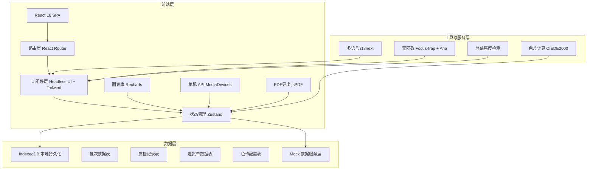
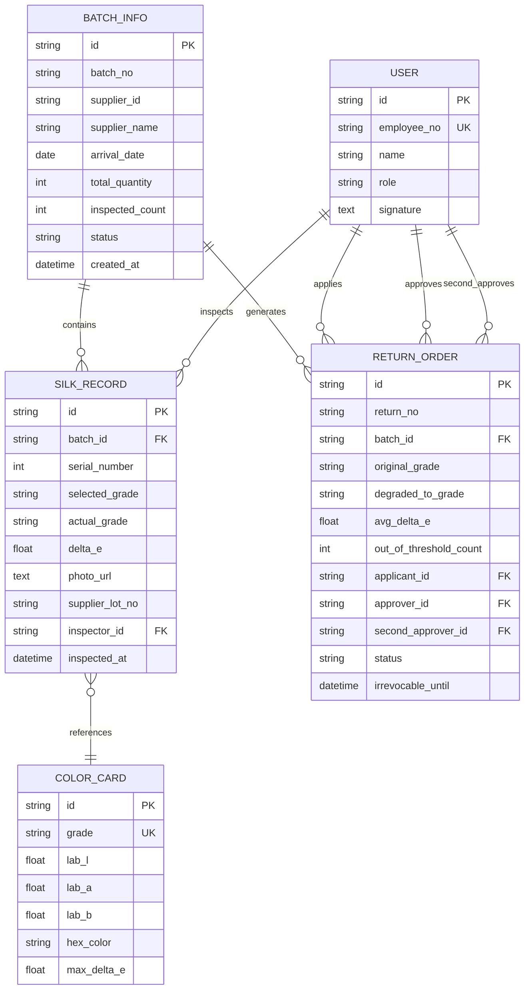

## 1. 架构设计



---

## 2. 技术栈说明

- **前端框架**：React@18.2.0 + TypeScript@5
- **构建工具**：Vite@5
- **UI 组件**：@headlessui/react@2 — 无障碍焦点管理、Dialog、Listbox、Tabs
- **样式方案**：tailwindcss@3.4 + postcss + autoprefixer
- **状态管理**：zustand@4 — 轻量级状态，支持中间件持久化
- **路由**：react-router-dom@6
- **图表**：recharts@2 — 饼图、折线图、柱状图
- **色差计算**：delta-e@0.0.8 — CIEDE2000 色差公式
- **多语言**：i18next@23 + react-i18next@13
- **PDF导出**：jspdf@2 + html2canvas@1
- **图标**：lucide-react@0.344
- **日期处理**：dayjs@1
- **数据持久化**：localForage@1（IndexedDB 封装）
- **表单校验**：react-hook-form@7 + zod@3

---

## 3. 路由定义

| 路由路径 | 页面组件 | 功能说明 |
|----------|----------|----------|
| `/` | DashboardPage | 批次总览、快捷入口、待办提醒 |
| `/inspection` | InspectionPage | 比色录入台（核心工作区） |
| `/inspection/:batchId` | InspectionDetailPage | 指定批次的逐条录入界面 |
| `/batches` | BatchListPage | 批次列表、筛选、搜索 |
| `/batches/:batchId/summary` | BatchSummaryPage | 单批次等级分布汇总 |
| `/history` | HistoryComparePage | 历史批次对比、色偏趋势 |
| `/approvals` | ApprovalListPage | 降级审批列表、待办队列 |
| `/approvals/:returnId` | ApprovalDetailPage | 双人确认界面、签名流程 |
| `/reports` | ReportListPage | 报告中心、导出记录 |
| `/reports/:batchId/export` | ReportExportPage | 多语言报告生成与导出 |
| `/settings` | SettingsPage | 色卡阈值配置、暗箱参数、用户管理 |

---

## 4. 类型定义

```typescript
// 藏红等级枚举
enum SaffronGrade {
  GRADE_S = 'S',   // Super Negin 特级
  GRADE_A = 'A',   // Negin 一级
  GRADE_B = 'B',   // Sargol 二级
  GRADE_C = 'C',   // Pushal 三级
  GRADE_D = 'D',   // Bunch 四级
  GRADE_E = 'E',   // 五级（不合格）
  GRADE_F = 'F',   // 六级（退货）
}

// 标准色卡配置
interface ColorCard {
  id: string;
  grade: SaffronGrade;
  labColor: { L: number; a: number; b: number };
  hexColor: string;
  description: string;
  maxDeltaE: number;  // 该等级允许的最大色差阈值
}

// 丝线质检记录
interface SilkRecord {
  id: string;
  batchId: string;
  serialNumber: number;        // 批次内第几条
  selectedGrade: SaffronGrade; // 质检员判定等级
  actualGrade: SaffronGrade;   // 系统判定等级（基于色差）
  deltaE: number;              // 实际色差值
  photoUrl?: string;           // 照片存储路径/Base64
  supplierLotNo: string;       // 供应商批号
  inspectorId: string;
  inspectedAt: string;
  remark?: string;
}

// 批次信息
interface BatchInfo {
  id: string;
  batchNo: string;
  supplierId: string;
  supplierName: string;
  arrivalDate: string;
  totalQuantity: number;       // 丝线总条数
  inspectedCount: number;
  gradeDistribution: Record<SaffronGrade, number>;
  status: 'PENDING' | 'INSPECTING' | 'INSPECTED' | 'DEGRADED' | 'RETURNED';
  createdAt: string;
  createdBy: string;
}

// 退货单
interface ReturnOrder {
  id: string;
  returnNo: string;
  batchId: string;
  originalGrade: SaffronGrade;
  degradedToGrade: SaffronGrade;
  degradationReason: string;
  avgDeltaE: number;
  maxDeltaE: number;
  outOfThresholdCount: number;
  applicantId: string;
  approverId?: string;
  secondApproverId?: string;
  applicantSign?: string;
  approverSign?: string;
  secondApproverSign?: string;
  status: 'PENDING_APPROVAL' | 'FIRST_APPROVED' | 'FINAL_APPROVED' | 'LOCKED' | 'EFFECTIVE';
  createdAt: string;
  firstApprovedAt?: string;
  finalApprovedAt?: string;
  irrevocableUntil: string;    // 24小时不可撤销截止时间
}

// 用户
interface User {
  id: string;
  employeeNo: string;
  name: string;
  role: 'INSPECTOR' | 'SUPERVISOR' | 'MANAGER';
  signature?: string;  // Base64 签名图片
}
```

---

## 5. 数据模型

### 5.1 ER 图



### 5.2 初始色卡数据

```typescript
const DEFAULT_COLOR_CARDS: ColorCard[] = [
  {
    id: 'card-s', grade: SaffronGrade.GRADE_S,
    labColor: { L: 26.5, a: 48.2, b: 42.1 },
    hexColor: '#B22222', description: 'Super Negin 特级藏红花', maxDeltaE: 2.0,
  },
  {
    id: 'card-a', grade: SaffronGrade.GRADE_A,
    labColor: { L: 30.1, a: 45.8, b: 40.5 },
    hexColor: '#CD2626', description: 'Negin 一级藏红花', maxDeltaE: 3.0,
  },
  {
    id: 'card-b', grade: SaffronGrade.GRADE_B,
    labColor: { L: 34.2, a: 42.5, b: 38.8 },
    hexColor: '#DC143C', description: 'Sargol 二级藏红花', maxDeltaE: 4.0,
  },
  {
    id: 'card-c', grade: SaffronGrade.GRADE_C,
    labColor: { L: 38.6, a: 39.2, b: 36.5 },
    hexColor: '#E03E3E', description: 'Pushal 三级藏红花', maxDeltaE: 5.0,
  },
  {
    id: 'card-d', grade: SaffronGrade.GRADE_D,
    labColor: { L: 43.1, a: 35.8, b: 34.2 },
    hexColor: '#E55B5B', description: 'Bunch 四级藏红花', maxDeltaE: 6.0,
  },
  {
    id: 'card-e', grade: SaffronGrade.GRADE_E,
    labColor: { L: 48.5, a: 32.0, b: 31.5 },
    hexColor: '#EB7878', description: '五级（不合格）', maxDeltaE: 8.0,
  },
  {
    id: 'card-f', grade: SaffronGrade.GRADE_F,
    labColor: { L: 55.2, a: 26.5, b: 27.8 },
    hexColor: '#F09A9A', description: '六级（必须退货）', maxDeltaE: 99.0,
  },
];
```

---

## 6. 关键技术实现要点

### 6.1 无障碍焦点管理（Headless UI）

- 使用 `@headlessui/react` 的 `FocusTrap` 包裹对话框、模态框
- 色卡条通过 `Listbox` 组件实现，天然支持键盘上下左右导航
- 所有可交互元素添加 `aria-label`、`aria-describedby`
- 降级确认流程使用 `Dialog` 组件，自动锁定焦点于确认按钮
- 使用 `useFocusRing` 自定义焦点样式（金箔色 2px 描边 + 4px 偏移外发光）

### 6.2 色差计算逻辑

```typescript
// 输入：用户选择的 LAB 值 vs 色卡 LAB 值
// 输出：最近等级 + Delta E 值
function calculateGradeDeltaE(userLAB: LAB, cards: ColorCard[]): {
  grade: SaffronGrade;
  deltaE: number;
  isWithinThreshold: boolean;
} {
  let minDelta = Infinity;
  let closestCard: ColorCard | null = null;
  
  for (const card of cards) {
    const delta = ciede2000(userLAB, card.labColor);
    if (delta < minDelta) {
      minDelta = delta;
      closestCard = card;
    }
  }
  
  return {
    grade: closestCard!.grade,
    deltaE: +minDelta.toFixed(2),
    isWithinThreshold: minDelta <= closestCard!.maxDeltaE,
  };
}
```

### 6.3 退货单 24 小时锁定机制

```typescript
// 退货单状态流转
// PENDING_APPROVAL → FIRST_APPROVED → FINAL_APPROVED → LOCKED(24h) → EFFECTIVE
function checkReturnOrderStatus(order: ReturnOrder): ReturnOrder {
  const now = dayjs();
  if (order.status === 'FINAL_APPROVED' && now.isAfter(order.irrevocableUntil)) {
    return { ...order, status: 'EFFECTIVE' };
  }
  // 24小时内状态为 LOCKED，前端校验禁止撤销
  if (order.status === 'FINAL_APPROVED' && now.isBefore(order.irrevocableUntil)) {
    return { ...order, status: 'LOCKED' };
  }
  return order;
}
```

### 6.4 暗箱模式实现

- CSS 变量 `--screen-brightness` 控制全局亮度滤镜
- `window.matchMedia('(prefers-color-scheme)')` 监听系统亮度
- 全屏 API `element.requestFullscreen()` 强制全屏
- 定时轮询 `screen.orientation` + `window.devicePixelRatio` 检测环境变化
- 顶部呼吸灯条通过 `@keyframes` 实现 3s 周期脉冲
