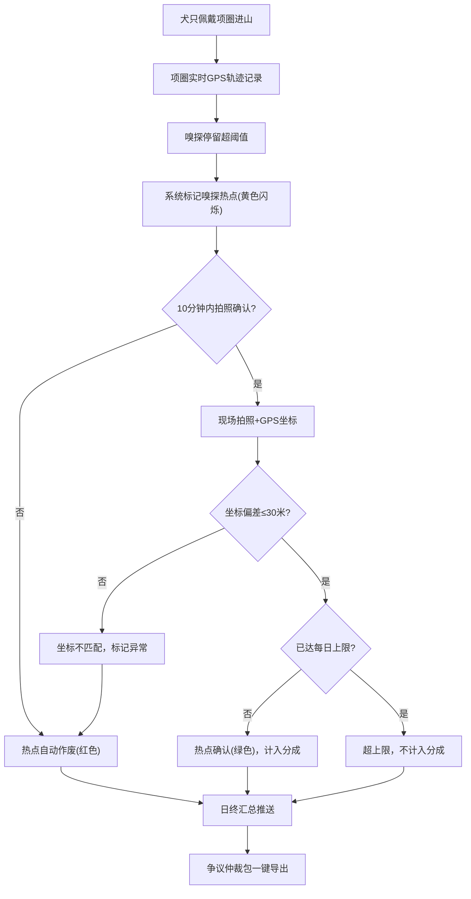

## 1. 产品概述

松露犬踪热点库——为产区合作社提供松露嗅探热点合规管理的全流程系统。解决农户与合作社间因松露分配产生的纠纷，通过项圈轨迹热力图叠加地图、现场拍照与坐标双确认机制，确保每个计入分成的热点都有不可篡改的证据链。

- 核心问题：法院对纯纸图标记不予采信，须项圈轨迹与现场拍照坐标双确认方可计入分成
- 目标用户：合作社负责人、农户、仲裁人员

## 2. 核心功能

### 2.1 用户角色

| 角色 | 注册方式 | 核心权限 |
|------|----------|----------|
| 合作社负责人 | 管理员分配 | 查看全量数据、日终汇总推送、仲裁包导出、规约配置 |
| 农户 | 负责人邀请 | 查看自己犬只轨迹与热点、现场拍照确认、分成查看 |
| 仲裁人员 | 负责人授权 | 只读查看轨迹与照片、导出仲裁包 |

### 2.2 功能模块

1. **地图总览页**：项圈轨迹热力图叠加底图、嗅探热点标记、区域筛选
2. **热点确认页**：现场拍照、坐标双验、10分钟倒计时、确认/作废状态
3. **犬只档案页**：犬只信息、绑定农户、分成规则、历史热点统计
4. **日终汇总页**：当日各犬热点统计、合规/剔除汇总、推送合作社负责人
5. **仲裁中心页**：争议仲裁包一键导出（含轨迹+照片）、历史仲裁记录

### 2.3 页面详情

| 页面名称 | 模块名称 | 功能描述 |
|----------|----------|----------|
| 地图总览页 | 轨迹热力图 | 项圈GPS轨迹渲染为热力图层叠加在地图上，支持多犬轨迹叠加显示 |
| 地图总览页 | 嗅探热点标记 | 已确认热点显示为绿色标记，未确认显示为黄色闪烁，已作废显示为红色删除线 |
| 地图总览页 | 离线地图缓存 | 山林区域瓦片预缓存，支持离线浏览轨迹与热点 |
| 热点确认页 | 现场拍照 | 调用设备摄像头拍照，照片嵌入GPS坐标与时间戳 |
| 热点确认页 | 坐标双验 | 对比项圈GPS坐标与拍照GPS坐标，偏差≤30米视为匹配 |
| 热点确认页 | 10分钟倒计时 | 从犬只标记嗅探热点起计时，超时自动作废 |
| 犬只档案页 | 犬只信息 | 犬名、品种、项圈ID、年龄等基础信息 |
| 犬只档案页 | 农户绑定 | 犬只与农户关联，支持一犬一户 |
| 犬只档案页 | 分成规则 | 按合作社规约设置该犬热点分成比例 |
| 日终汇总页 | 汇总统计 | 各犬当日热点数、合规数、剔除数、待确认数 |
| 日终汇总页 | 推送通知 | 合作社负责人收到日终汇总推送 |
| 仲裁中心页 | 仲裁包导出 | 一键导出含轨迹GPX+现场照片+坐标时间戳的压缩包 |
| 仲裁中心页 | 历史记录 | 按日期查看历史仲裁包 |

## 3. 核心流程

1. 犬只佩戴项圈进入山林，项圈实时记录GPS轨迹
2. 犬只在某处停留嗅探超过阈值，系统自动标记为嗅探热点
3. 农户须在10分钟内到达热点位置，现场拍照确认
4. 系统比对拍照GPS与项圈GPS坐标，偏差≤30米则双验通过
5. 双验通过的热点计入分成；无照片或超时热点自动剔除
6. 同犬同日热点数达合作社规约上限后，新增热点不计入分成
7. 日终系统自动汇总，推送合作社负责人
8. 争议时一键导出仲裁包，含完整轨迹与照片证据链

## 4. 用户界面设计

### 4.1 设计风格

- **主色调**：深林绿（#1B4332）+ 琥珀金（#D4A017）强调色，呼应松露产区山林氛围
- **次色调**：暖灰（#F5F0EB）背景，深棕（#3E2723）文字
- **按钮风格**：圆角8px，主要操作深林绿填充，危险操作琥珀金描边
- **字体**：正文 Noto Sans SC，数据展示 DIN Alternate
- **布局风格**：左侧地图主区域（70%宽度）+ 右侧信息面板（30%宽度），大屏优先
- **图标**：线性图标风格，lucide-react 图标库

### 4.2 页面设计概览

| 页面名称 | 模块名称 | UI元素 |
|----------|----------|--------|
| 地图总览页 | 轨迹热力图 | 全幅地图、渐变热力层、图例、犬只轨迹线 |
| 地图总览页 | 热点标记 | 绿/黄/红色标记点、脉冲动画(待确认)、删除线(作废) |
| 地图总览页 | 左侧面板 | 犬只列表、日期筛选、图层开关、离线缓存状态 |
| 热点确认页 | 拍照区域 | 摄像头预览、拍照按钮、已拍照片缩略图 |
| 热点确认页 | 坐标对比 | 项圈坐标/拍照坐标双栏显示、偏差值高亮 |
| 热点确认页 | 倒计时 | 环形进度条、秒数递减、超时警告 |
| 犬只档案页 | 档案卡片 | 犬只头像、基础信息表、绑定农户、分成比例条 |
| 日终汇总页 | 统计面板 | 各犬统计行、合规率环形图、推送状态标识 |
| 仲裁中心页 | 导出面板 | 日期选择器、导出按钮、历史仲裁包列表 |

### 4.3 响应式策略

- 桌面优先设计（1920×1080 大屏）
- 平板端信息面板折叠为底部抽屉
- 移动端地图全屏，信息覆盖为浮动卡片

### 4.4 离线策略

- 山林区域瓦片预缓存至 IndexedDB
- 离线时轨迹与热点数据存入本地队列，上线后同步
- Service Worker 拦截地图瓦片请求，优先读取缓存
