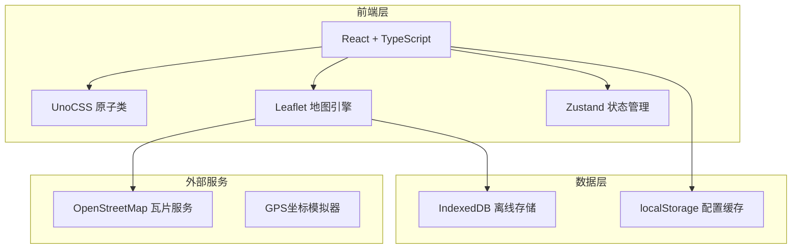
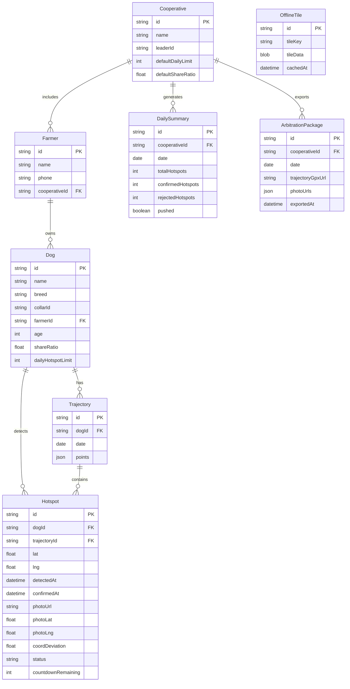

## 1. 架构设计

## 2. 技术说明

- **前端**：React@18 + TypeScript + UnoCSS（用户指定原子类，按需生成控制体积）+ Vite
- **地图引擎**：Leaflet + react-leaflet（开源轻量，离线友好）
- **热力图**：leaflet-heat（轨迹热力渲染）
- **状态管理**：Zustand
- **离线存储**：IndexedDB（Dexie.js 封装）+ Service Worker
- **路由**：react-router-dom
- **初始化工具**：vite-init
- **后端**：无（前端纯静态，Mock 数据模拟）

## 3. 路由定义

| 路由 | 用途 |
|------|------|
| `/` | 地图总览页（默认首页），轨迹热力图+热点标记 |
| `/confirm/:hotspotId` | 热点确认页，拍照+坐标双验+倒计时 |
| `/dogs` | 犬只档案列表页 |
| `/dogs/:dogId` | 犬只档案详情，含分成规则 |
| `/summary` | 日终汇总页，统计+推送 |
| `/arbitration` | 仲裁中心页，导出+历史 |

## 4. 数据模型

### 4.1 数据模型定义

### 4.2 状态枚举

- **Hotspot.status**: `pending`（待确认，黄色闪烁）| `confirmed`（已确认，绿色）| `expired`（超时作废，红色）| `mismatch`（坐标不匹配，红色）| `over_limit`（超上限不计入，灰色）

## 5. 关键技术方案

### 5.1 项圈轨迹热力图

- 使用 leaflet-heat 插件，将 Trajectory.points 数组转为热力数据
- 热力值按停留时长加权：停留越久热力值越高
- 多犬轨迹可叠加渲染，不同犬只用不同色系区分

### 5.2 现场拍照与坐标双验

- 调用 navigator.mediaDevices.getUserMedia 获取摄像头
- 使用 navigator.geolocation.getCurrentPosition 获取拍照时GPS
- 比对项圈GPS与拍照GPS的 Haversine 距离，≤30米为匹配

### 5.3 离线地图缓存

- Service Worker 拦截 OSM 瓦片请求
- 预缓存指定山林区域（lat/lng 范围+zoom层级）的瓦片
- 缓存存入 IndexedDB，支持缓存续用与更新
- 离线时从 IndexedDB 读取瓦片

### 5.4 仲裁包导出

- 将轨迹数据转为 GPX 格式
- 照片打包为原始文件（含EXIF GPS信息）
- 使用 JSZip 打包为 ZIP 文件下载

### 5.5 UnoCSS 配置

- 替代 Tailwind CSS，使用 @unocss/preset-uno 预设
- 配置 @unocss/preset-icons 替代图标方案
- 大屏信息密度高，按需生成原子类控制产物体积
