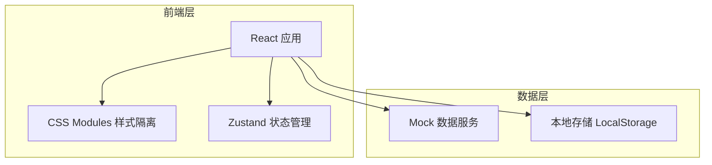
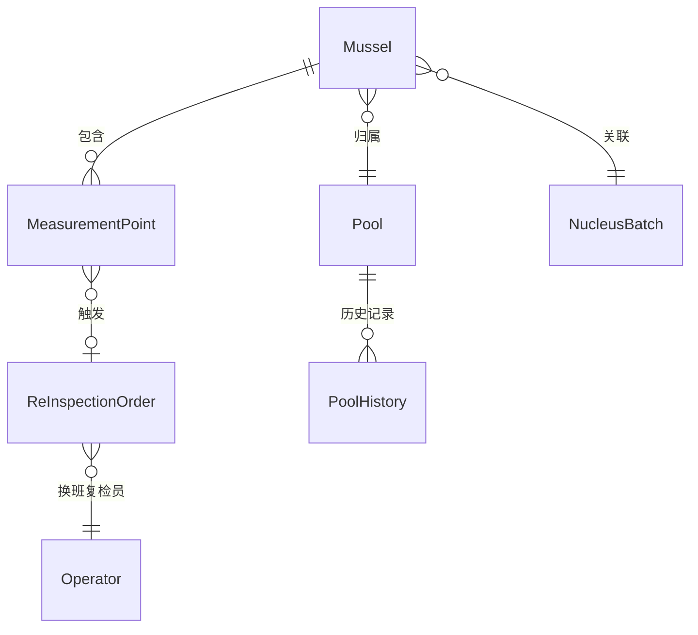

## 1. 架构设计



纯前端应用，无后端服务。数据存储在 LocalStorage，历史数据使用 Mock 服务模拟。

## 2. 技术说明

- **前端框架**：React 18 + TypeScript
- **构建工具**：Vite
- **样式方案**：纯 CSS Modules（白标租户样式隔离硬边界）
- **状态管理**：Zustand
- **路由**：react-router-dom
- **图表**：Canvas 自绘（直方图 + 历史曲线），避免引入重型图表库
- **导出**：基于 Blob 的文本/CSV 导出
- **数据**：Mock 数据 + LocalStorage 持久化

> 注意：用户明确要求纯 CSS Modules，不使用 Tailwind CSS

## 3. 路由定义

| 路由 | 用途 |
|------|------|
| `/` | 测厚仪表盘主页面（蚌壳示意图 + 仪表盘 + 直方图 + 复检面板） |
| `/history` | 历史厚度曲线对比页面 |

## 4. 数据模型

### 4.1 核心类型定义

```typescript
interface MeasurementPoint {
  id: string;
  x: number;        // SVG坐标系x
  y: number;        // SVG坐标系y
  thickness: number; // mm
  quadrant: 1 | 2 | 3 | 4;
  isThin: boolean;
  batchId: string | null;
  timestamp: number;
}

interface Mussel {
  id: string;
  poolId: string;
  batchId: string;
  points: MeasurementPoint[];
  grade: string | null;
  canGrade: boolean;
  createdAt: number;
}

interface ReInspectionOrder {
  id: string;
  musselId: string;
  pointId: string;
  reason: string;
  originalValue: number;
  recheckValue: number | null;
  originalOperator: string;
  recheckOperator: string | null;
  status: 'pending' | 'completed';
  createdAt: number;
  completedAt: number | null;
}

interface PoolHistory {
  poolId: string;
  date: string;
  avgThickness: number;
  minThickness: number;
  pointCount: number;
}
```

### 4.2 数据关系



## 5. 组件架构

```
src/
├── components/
│   ├── MusselDiagram/       # 蚌壳SVG测量点示意图
│   ├── ThicknessGauge/      # 厚度仪表盘
│   ├── ThicknessHistogram/  # 厚度分布直方图
│   ├── ThinLayerAlert/      # 薄层区标红卡片
│   ├── GradeStatus/         # 分级状态栏
│   ├── ReInspectionPanel/   # 复检工单面板
│   ├── HistoryChart/        # 历史厚度曲线
│   └── CertificateExport/   # 证书导出
├── store/
│   └── useAppStore.ts       # Zustand全局状态
├── utils/
│   ├── grading.ts           # 分级计算逻辑
│   ├── statistics.ts        # 统计计算（均值/标准差/异常判定）
│   └── export.ts            # 证书导出工具
├── mock/
│   └── data.ts              # 模拟历史数据
├── pages/
│   ├── Dashboard.tsx         # 仪表盘主页
│   └── History.tsx           # 历史对比页
└── types/
    └── index.ts              # 类型定义
```
