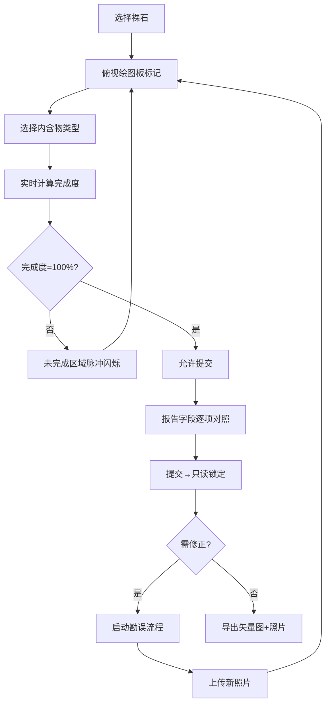

## 1. 产品概述
「钻石内含Plot台」是裸石加工坊专业质检绘图工具，用于对标国际钻石评级报告时精确标记内含物位置与类型，解决手绘误差导致评级下调的问题，单颗避免损失近万元。目标用户为质检主管与值守人员。

## 2. 核心功能

### 2.1 用户角色
| 角色 | 注册方式 | 核心权限 |
|------|----------|----------|
| 质检主管 | 工号登录 | 审核提交、勘误审批、队列管理 |
| 值守人员 | 工号登录 | 绘图标记、批量切换、导出报告 |

### 2.2 功能模块
1. **主绘图工作台**：俯视绘图板、内含物点选、图例面板、完成度显示
2. **报告对照模块**：国际报告字段映射、逐项校验、矢量图叠加导出
3. **队列管理模块**：裸石列表、快速切换、状态标识
4. **合规流程模块**：提交后只读、勘误子流程、新照片上传

### 2.3 页面详情
| 页面名称 | 模块名称 | 功能描述 |
|----------|----------|----------|
| 主工作台 | 俯视绘图板 | SVG圆形绘图区域，点击标记内含物，支持拖拽调整位置 |
| 主工作台 | 图例面板 | 内含物类型图标与颜色对照，点击选择当前标记类型 |
| 主工作台 | 完成度指示器 | 实时百分比显示，进度条动画，100%前禁止提交 |
| 主工作台 | 未完成区域提示 | 脉冲闪烁动画标识遗漏区域 |
| 报告对照页 | 字段对照表 | 与GIA/IGI等国际报告字段逐项映射对照 |
| 报告对照页 | 矢量图导出 | SVG叠加照片导出，支持PNG/SVG格式 |
| 队列侧边栏 | 裸石列表 | 卡片式展示，支持快速切换，状态颜色标识 |
| 勘误弹窗 | 修正流程 | 提交后只读，修正须走勘误流程并上传新照片 |

## 3. 核心流程
质检人员从队列选择裸石 → 在俯视绘图板点选内含物位置 → 选择内含物类型 → 系统实时计算完成度 → 未完成区域脉冲闪烁提示 → 完成度达100% → 提交对标报告 → 提交后只读锁定 → 如需修正启动勘误子流程 → 上传新照片 → 重新绘图。

## 4. 用户界面设计

### 4.1 设计风格
- **主色调**：深邃蓝（#0F172A）、钻石金（#D4AF37）、纯净白（#F8FAFC）
- **辅助色**：各类内含物标记色（红宝石红#DC2626、祖母绿#059669、蓝宝石#2563EB等）
- **按钮风格**：圆角8px，hover时金色边框发光效果，disabled时灰化
- **字体**：主标题使用Playfair Display（高端珠宝感），正文使用Inter（清晰可读）
- **布局风格**：三栏栅格布局（左队列、中绘图板、右图例+详情），Bootstrap5类名体系
- **图标**：Lucide图标库，结合钻石内含物专用符号

### 4.2 页面设计概述
| 页面名称 | 模块名称 | UI元素 |
|----------|----------|--------|
| 主工作台 | 俯视绘图板 | 圆形SVG画布，网格参考线，点击放置内含物图标 |
| 主工作台 | 完成度环 | 环形进度条，中心百分比数字，100%时金色发光 |
| 主工作台 | 图例面板 | 卡片网格，每项含图标+颜色+名称+数量统计 |
| 队列侧边栏 | 裸石卡片 | 缩略图、编号、进度条、状态标签（进行中/已提交/待勘误） |
| 报告对照页 | 字段表格 | 左右两列对照，本系统字段 vs 国际报告字段，勾选确认 |

### 4.3 响应式
- Desktop-first设计，主绘图区最小宽度800px
- 平板端：左右面板可折叠收起，绘图区自适应
- 移动端：竖屏单列布局，队列改为底部Tab切换

### 4.4 动效设计
- 页面加载：左中右三栏依次滑入（stagger动画）
- 内含物放置：弹性缩放+涟漪扩散效果
- 脉冲闪烁：未完成区域呼吸灯动画，频率2s
- 完成度达100%：金色粒子爆发效果，提交按钮解锁动画
- 队列切换：交叉溶解过渡
