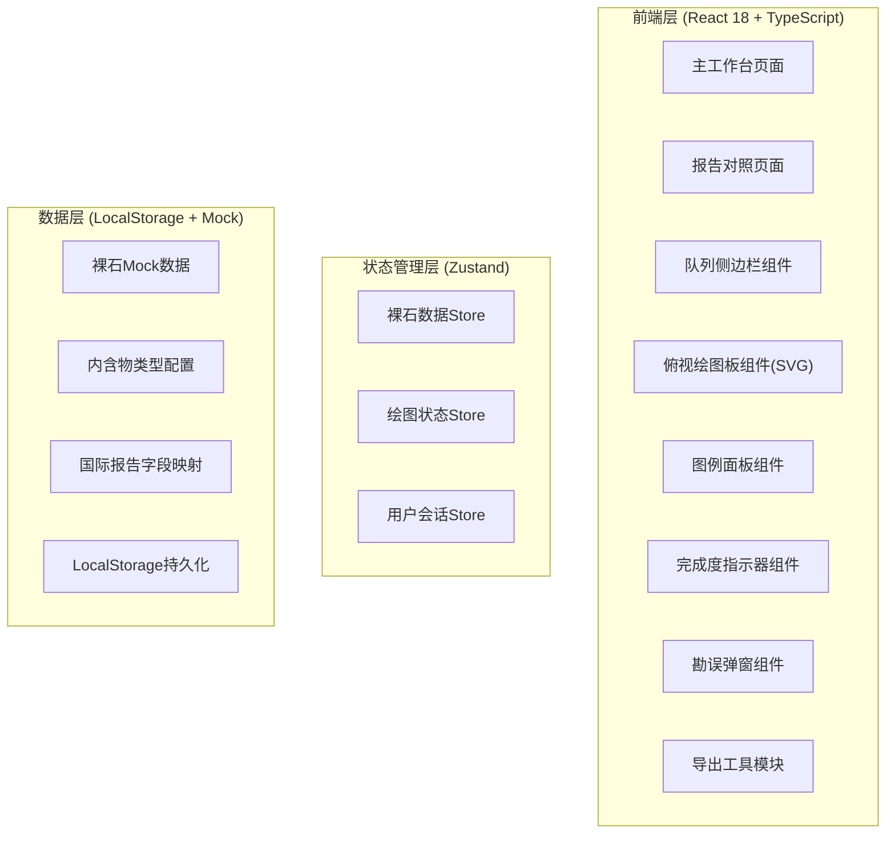
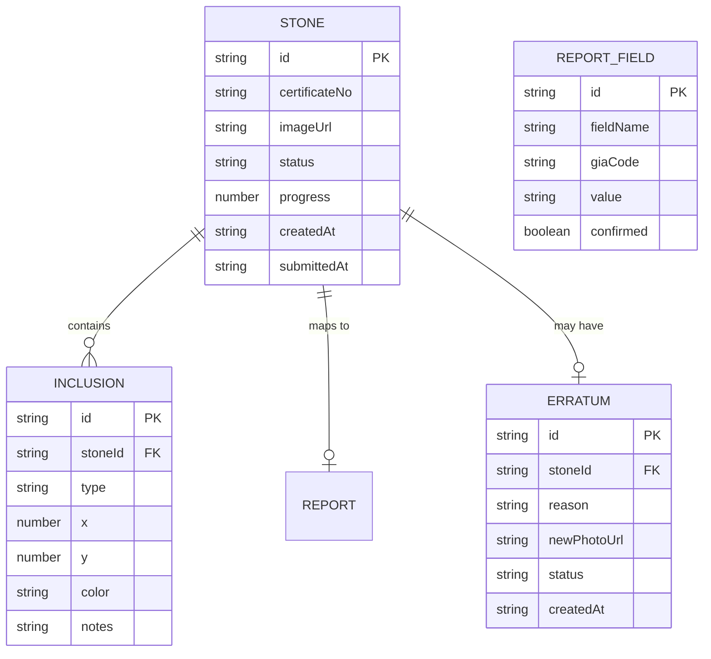

## 1. 架构设计



## 2. 技术描述
- **前端**: React 18 + TypeScript + Vite 5
- **样式**: Bootstrap 5 工具类 + Tailwind CSS 3（工具类互补）
- **状态管理**: Zustand 4
- **图标**: Lucide React
- **绘图**: 原生 SVG + Canvas 2D API
- **导出**: html2canvas + SVG 序列化
- **后端**: 无后端纯前端，数据持久化到 LocalStorage
- **Mock数据**: 内置6颗裸石测试数据，覆盖不同进度状态

## 3. 路由定义
| 路由 | 用途 |
|------|------|
| / | 主工作台（俯视绘图板 + 队列 + 图例） |
| /report/:stoneId | 国际报告字段对照页 |
| /erratum/:stoneId | 勘误流程页 |

## 4. 数据模型

### 4.1 数据模型定义



### 4.2 TypeScript 类型定义

```typescript
// 内含物类型
type InclusionType = 'crystal' | 'feather' | 'cloud' | 'needle' | 'cavity' | 'chip' | 'cleavage' | 'grain_center';

// 内含物标记
interface Inclusion {
  id: string;
  stoneId: string;
  type: InclusionType;
  x: number;
  y: number;
  color: string;
  notes?: string;
  createdAt: string;
}

// 裸石状态
type StoneStatus = 'pending' | 'in_progress' | 'submitted' | 'erratum_pending' | 'erratum_approved';

// 裸石数据
interface Stone {
  id: string;
  certificateNo: string;
  carat: number;
  color: string;
  clarity: string;
  imageUrl: string;
  status: StoneStatus;
  inclusions: Inclusion[];
  progress: number;
  requiredInclusionCount: number;
  createdAt: string;
  submittedAt?: string;
  report?: GIA_report;
}

// GIA报告字段映射
interface GIA_Report {
  stoneId: string;
  measurements: string;
  caratWeight: string;
  colorGrade: string;
  clarityGrade: string;
  cutGrade: string;
  proportions: Record<string, string>;
  clarityCharacteristics: string[];
  finish: Record<string, string>;
  fluorescence: string;
}

// 内含物类型配置
interface InclusionTypeConfig {
  type: InclusionType;
  name: string;
  iconName: string;
  color: string;
  description: string;
}
```

## 5. 核心模块设计

### 5.1 绘图板模块
- SVG 500x500 圆形画布，坐标归一化(0-100%)
- 点击放置内含物图标，支持拖拽调整位置
- 右键删除标记
- 网格参考线（8等分扇区+同心圆）
- 内含物类型配置（8种标准类型）

### 5.2 完成度计算
```
完成度 = (已标记内含物数量 / 国际报告要求数量) × 100%
每类内含物单独计数，未达到数量要求的扇区脉冲闪烁
```

### 5.3 合规控制
- `status === 'submitted'` 时绘图板禁用交互
- 勘误流程：填写原因 → 上传新照片 → 主管审批 → 解锁编辑
- 所有操作记录 LocalStorage 审计日志

### 5.4 导出功能
- SVG + 照片叠加导出
- 支持 PNG（位图）和 SVG（矢量）格式
- 导出时自动注入证书编号水印
