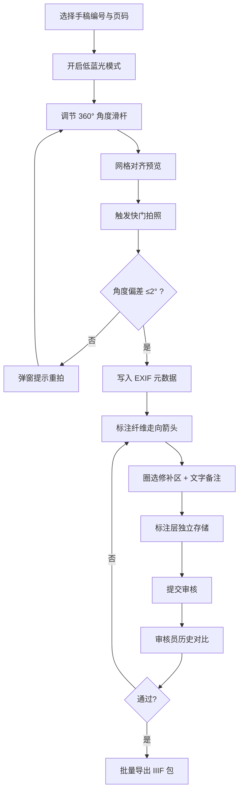

## 1. 产品概述

针对文献修复项目外审整改需求，打造一套支持移动巡检与桌面工作站复用的手稿侧光采集与标注系统。核心解决：侧光角度无记录导致纤维走向分析不可复现、修复师双手持稿不便手工记录、标注与原图混存不便审计三大痛点。

- 面向文献修复师、质量审核员、外审专家三类用户
- 支撑从采集→标注→校验→导出→审计全流程闭环

## 2. 核心功能

### 2.1 用户角色

| 角色 | 注册方式 | 核心权限 |
|------|----------|----------|
| 修复师 | 工号登录 | 侧光采集、标注纤维走向与修补区、提交审核 |
| 审核员 | 工号登录 | 角度偏差校验、历史修复对比、通过/驳回 |
| 外审专家 | 邀请链接 | 只读查看采集数据、导出 IIIF 包、审计标注追溯 |

### 2.2 功能模块

1. **采集控制台**：360° 角度滑杆、实时预览、低蓝光切换、快门触发
2. **标注工作台**：纤维走向箭头、修补区多边形圈选、文字备注、标注层开关
3. **采集记录列表**：按手稿/页码检索、角度偏差预警标红、批量选择导出
4. **历史对比视图**：同页多版本叠放对比、差异热区高亮
5. **IIIF 导出中心**：批量打包、国际标准校验、导出任务进度

### 2.3 页面详情

| 页面名称 | 模块名称 | 功能描述 |
|----------|----------|----------|
| 采集控制台 | 角度滑杆组件 | 0-360° 连续可调，实时显示当前角度，吸附式刻度（每 15° 一档） |
| 采集控制台 | 相机预览区 | 实时画面、低蓝光滤镜叠加、网格线辅助对齐 |
| 采集控制台 | 快门与元数据 | 拍照自动写入 EXIF（角度、时间、工号、手稿编号） |
| 标注工作台 | 纤维走向箭头 | 拖拽起点终点、自动吸附角度刻度、可旋转微调 |
| 标注工作台 | 多边形圈选 | 点击添加顶点、闭合选区、支持撤销顶点、备注弹窗 |
| 标注工作台 | 图层管理 | 原始层/箭头层/修补区层独立显隐、透明度调节 |
| 采集记录列表 | 偏差预警 | 与目标角度差 >2° 标红、强制重拍按钮 |
| 采集记录列表 | 筛选检索 | 手稿编号、页码、采集日期、采集人筛选 |
| 历史对比视图 | 版本对比 | 左右分屏或叠加模式、差异像素热区叠加 |
| IIIF 导出中心 | 批量导出 | 生成 manifest.json、图像转 JPEG2000/PNG、打包 ZIP |

## 3. 核心流程

修复师从采集控制台开始：选择手稿→设置低蓝光→调节滑杆角度→预览对齐→快门拍照→系统写入角度元数据→角度偏差 >2° 弹窗重拍→进入标注工作台→标注纤维走向箭头→圈选修补区并填写备注→保存（标注层独立存储）→提交审核。审核员对比历史版本→通过或驳回→外审专家批量导出 IIIF 包用于审计归档。

## 4. 用户界面设计

### 4.1 设计风格

- **主色调**：古籍亚麻米 `#F5EFE0` 为背景主色，深褐墨 `#3B2F2F` 为文字主色
- **强调色**：朱砂红 `#B23A48` 用于偏差预警与重拍提示，矿青蓝 `#2D5A7B` 用于角度滑杆与可交互元素
- **按钮风格**：圆角矩形（8px），次按钮采用描边+微阴影，主按钮采用矿青蓝填充+白色图标
- **字体选型**：标题采用「霞鹜文楷」体现古籍修复专业性，正文采用「思源黑体」保证移动端可读性
- **布局风格**：桌面端采用左工具-中画布-右属性三栏式；移动端采用底部工具抽屉+全屏画布
- **质感细节**：画布区域嵌入仿旧纸张纹理噪点、工具面板带 1px 褐色描边和轻微羊皮纸质感

### 4.2 页面设计概览

| 页面名称 | 模块名称 | UI 元素 |
|----------|----------|---------|
| 采集控制台 | 角度滑杆 | 环形角度指示盘+线性滑杆双形态，实时角度数字居中，矿青蓝描边 |
| 采集控制台 | 预览区 | 亚麻米衬底、16:10 画布比例、金色 1/3 分割网格线 |
| 标注工作台 | 画布 | 左侧工具竖列（箭头/多边形/橡皮擦），中央画布，右侧属性面板 |
| 标注工作台 | 箭头工具 | 拖拽产生墨褐色带箭头线段，末端可吸附 15° 整数倍角度 |
| 采集记录列表 | 预警行 | 角度超标行整行淡红底色，末列朱砂红「重拍」胶囊按钮 |
| 历史对比视图 | 分屏 | 中间可拖拽分割条，两侧独立缩放控制 |

### 4.3 响应式

- **桌面优先**：三栏式布局，画布区域 ≥ 800×600px
- **平板适配**：工具面板折叠为左侧可滑出抽屉
- **手机适配**：画布全屏，底部横向滚动工具栏，属性面板改为底部上滑 Modal
- **触摸优化**：滑杆增加 44px 触控热区，多边形顶点支持 24px 点击容差

### 4.4 3D 场景指引（不适用）

无 3D 场景需求。
