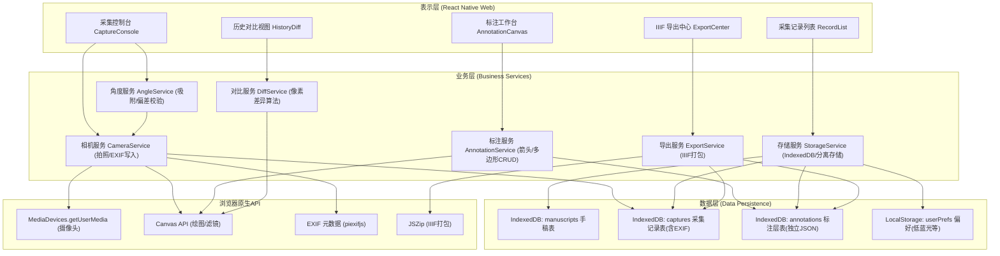
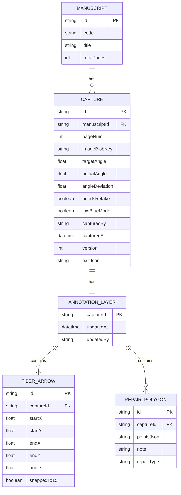

## 1. 架构设计



## 2. 技术选型说明

- **前端框架**：React@18 + React Native Web@0.19 — 满足移动巡检与桌面共用业务组件需求
- **初始化工具**：Vite@5 + @vitejs/plugin-react — 构建速度快，HMR 体验好
- **样式方案**：Tailwind CSS@3 + tailwind-react-native-classnames — RNW 生态下最成熟的原子化方案
- **路由**：React Router@6 + react-router-native — Web 与 Native 统一的路由抽象
- **状态管理**：Zustand@4 — 轻量且支持持久化中间件，适合移动端
- **元数据处理**：piexifjs — 纯 JS 实现的 EXIF 读写，无需 Native 依赖
- **图像滤镜**：Canvas 2D Context 像素级处理 + CSS filter（低蓝光）
- **存储方案**：IndexedDB（Dexie.js 封装）— 大容量原始图像 + 标注层 JSON 分离存储
- **打包导出**：JSZip — IIIF manifest + 图像文件打包为 ZIP
- **UI 组件**：自研定制组件（角度滑杆、画布编辑器），避免 RNW 兼容性问题

## 3. 路由定义

| Route Path (Web) | Route Name (Native) | 页面组件 | 用途 |
|------------------|---------------------|----------|------|
| `/` | `Home` | `HomeScreen` | 手稿列表与快速采集入口 |
| `/capture/:manuscriptId/:pageNum` | `Capture` | `CaptureConsole` | 侧光采集主界面 |
| `/annotate/:captureId` | `Annotate` | `AnnotationCanvas` | 标注工作台 |
| `/records` | `Records` | `RecordListScreen` | 采集记录列表与校验 |
| `/diff/:manuscriptId/:pageNum` | `HistoryDiff` | `HistoryDiffView` | 历史修复对比 |
| `/export` | `Export` | `ExportCenter` | IIIF 批量导出 |
| `/settings` | `Settings` | `SettingsScreen` | 低蓝光等偏好设置 |

## 4. API 定义（纯前端 Mock 接口）

```typescript
// 手稿实体
interface Manuscript {
  id: string;
  code: string;           // 手稿编号如 GB-00123
  title: string;          // 手稿名称
  totalPages: number;
  createdAt: number;
}

// 采集记录（含角度元数据）
interface CaptureRecord {
  id: string;
  manuscriptId: string;
  pageNum: number;
  imageUrl: string;       // Blob URL / IndexedDB key
  targetAngle: number;    // 目标角度（滑杆设置）
  actualAngle: number;    // 实际记录角度
  angleDeviation: number; // |actual - target|
  needsRetake: boolean;   // deviation > 2
  lowBlueMode: boolean;
  capturedBy: string;
  capturedAt: number;
  version: number;        // 同页版本号，用于历史对比
  exifMetadata: {         // 完整 EXIF 备份
    UserComment: string;  // JSON 字符串: {angle, operator, manuscriptCode}
    DateTimeOriginal: string;
  };
}

// 纤维走向箭头
interface FiberArrow {
  id: string;
  captureId: string;
  startX: number;         // 相对画布比例 0~1
  startY: number;
  endX: number;
  endY: number;
  angle: number;          // 记录角度，便于审计
  snappedTo15: boolean;   // 是否吸附至15度整数倍
  color: string;          // 默认 #3B2F2F
}

// 修补区域
interface RepairPolygon {
  id: string;
  captureId: string;
  points: Array<{x: number; y: number}>;  // 相对画布比例
  note: string;           // 文字备注
  repairType: '补缺' | '托裱' | '接笔' | '全色' | '其他';
}

// 标注层（与原始层完全分离）
interface AnnotationLayer {
  captureId: string;
  arrows: FiberArrow[];
  polygons: RepairPolygon[];
  updatedAt: number;
  updatedBy: string;
}

// 存储服务接口
interface StorageService {
  saveCapture(record: CaptureRecord, imageBlob: Blob): Promise<void>;
  getCapture(id: string): Promise<{record: CaptureRecord; blob: Blob} | null>;
  saveAnnotations(layer: AnnotationLayer): Promise<void>;
  getAnnotations(captureId: string): Promise<AnnotationLayer | null>;
  listCaptures(filters: Partial<CaptureRecord>): Promise<CaptureRecord[]>;
  compareVersions(manuscriptId: string, pageNum: number): Promise<CaptureRecord[]>;
}

// 角度服务接口
interface AngleService {
  snapTo15(angle: number): number;                // 吸附至最近15度整数倍
  computeDeviation(actual: number, target: number): number;
  needsRetake(deviation: number): boolean;        // >2° 返回 true
  formatAngle(angle: number): string;             // "045°" 三位补零格式
}

// EXIF 服务接口
interface ExifService {
  writeAngleMetadata(
    imageBlob: Blob,
    angle: number,
    extra: {operatorId: string; manuscriptCode: string; pageNum: number}
  ): Promise<Blob>;
  readAngleMetadata(imageBlob: Blob): Promise<number | null>;
}

// IIIF 导出接口
interface IIIFExportService {
  buildManifest(records: CaptureRecord[]): object;
  exportBatch(recordIds: string[], onProgress: (p: number) => void): Promise<Blob>;
}
```

## 5. 服务端架构（纯前端，无后端）

本项目为纯前端离线应用，无后端服务。所有数据持久化通过浏览器 IndexedDB 完成。导出数据通过浏览器下载 Blob 方式分发。

## 6. 数据模型

### 6.1 实体关系图



### 6.2 IndexedDB Schema (Dexie)

```typescript
// db.ts
import Dexie, { Table } from 'dexie';

export class ManuscriptDB extends Dexie {
  manuscripts!: Table<Manuscript, string>;
  captures!: Table<CaptureRecord, string>;
  annotations!: Table<AnnotationLayer, string>;
  imageBlobs!: Table<{id: string; blob: Blob}, string>;

  constructor() {
    super('manuscript-side-light');
    this.version(1).stores({
      manuscripts: 'id, code, createdAt',
      captures: 'id, manuscriptId, pageNum, [manuscriptId+pageNum], capturedAt, needsRetake',
      annotations: 'captureId, updatedAt',
      imageBlobs: 'id'
    });
  }
}
```

### 6.3 初始化 Mock 数据

```typescript
// seed.ts
export const seedMockData = async (db: ManuscriptDB) => {
  const existing = await db.manuscripts.count();
  if (existing > 0) return;
  await db.manuscripts.bulkAdd([
    {id: 'm1', code: 'GB-00123', title: '永乐大典·卷之二千三百四十七', totalPages: 42, createdAt: Date.now() - 86400000 * 30},
    {id: 'm2', code: 'GB-00456', title: '敦煌遗书·S.1234 维摩诘经', totalPages: 18, createdAt: Date.now() - 86400000 * 15}
  ]);
};
```
